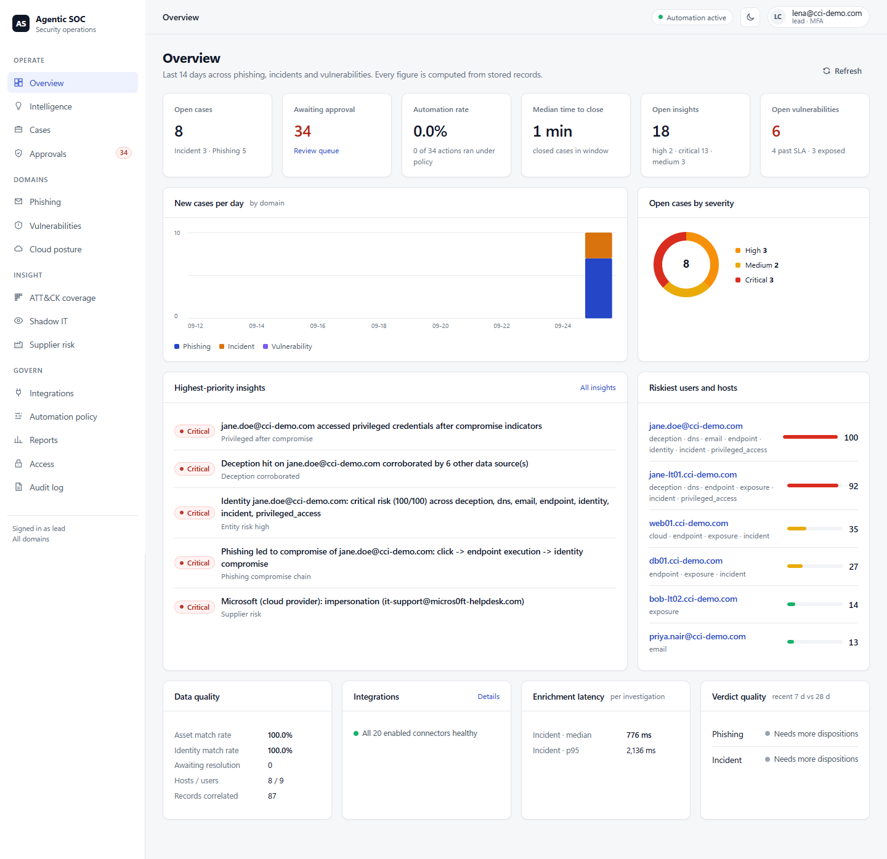
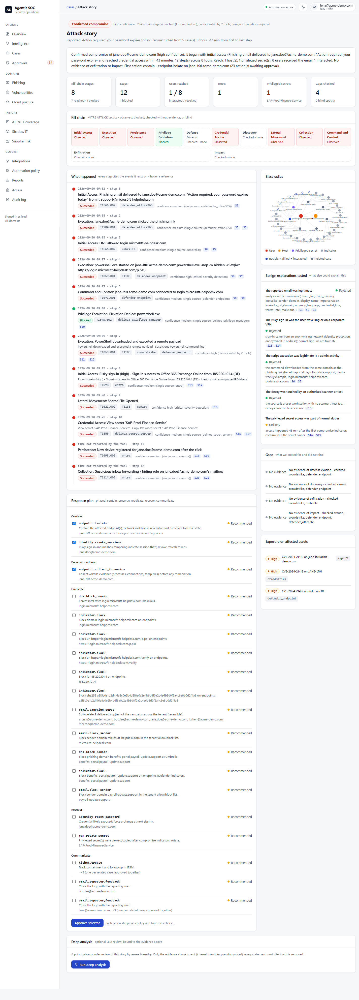

# Agentic SOC Platform

AI-assisted investigation and automation layer for a Security Operations Centre, built against the
*CCI SOC – AI & Automation Consolidated Requirements*. One platform serves three workflows over a shared,
governed context store, with a cross-domain intelligence layer on top.



| Module | What it does | Requirements |
|---|---|---|
| **Phishing / reported email** | Ingests user-reported mail, decomposes it (incl. QR codes), analyses it with the 7-agent ML swarm and a deterministic analyser, reconciles with Defender/Avanan, scopes the campaign tenant-wide, finds who clicked and whether any endpoint or identity was compromised, monitors supplier email risk, recommends gated remediation, answers the reporter, auto-closes clear benign reports with QA sampling | PH-F01…F16, PH-T01…T09, U16, U18 |
| **Incident management** | Ingests alerts from every tool, clusters them into incidents, enriches every entity in parallel across 8 dimensions, scores severity deterministically (exposure-informed), maps MITRE ATT&CK with evidence, recommends ranked guarded actions, recalls similar incidents, writes the shift handover | IM-F01…F16, IM-T01…T11, U04–U06, U13–U15 |
| **Vulnerability management** | Pulls findings from Rapid7, CrowdStrike, Wiz and Defender, resolves the same host across tools, deduplicates, prioritises (CVSS + EPSS + KEV + exposure + criticality), routes to owners, tracks plans, syncs ITSM tickets both ways, validates remediation (catches false closures), manages exceptions, runs Wiz misconfigurations through the same lifecycle, generates reports | VM-F01…F18, VM-T01…T13, U01–U03, U12 |
| **Intelligence layer** | Explainable per-user/host risk across all streams, 12 correlation rules, analyst assistant with cited answers, situation brief, ATT&CK coverage, shadow IT, drift monitoring | U02, U04, U06–U12, U16, U18, R14 |
| **Attack story** | The whole attack across every tool on one page: ATT&CK kill chain (observed / blocked / checked / blind), cited timeline, benign explanations tested, gaps, blast radius, phased response plan with one-step governed approval; optional evidence-bound LLM deep analysis | U08, U13, U14 |
| **Report builder** | Seven preconfigured standard reports (board deck, CISO brief, VM, phishing, post-incident, control assurance, SOC daily) and any other report described in words; figures computed in code, LLM narrative must cite them; scoped, audited, encrypted at rest | U01, U15, VM-F13 |

**Operating principle (NFR-01):** AI gathers and correlates; the analyst decides. Every action is policy-gated
(autonomy levels L0–L4, default *recommend*), nothing destructive runs autonomously, every conclusion cites its
evidence, every figure is computed in code, and every step lands in an append-only hash-chained audit log.

Nothing is tied to the sample data: the generalisation test renames the whole estate into another organisation
and requires identical results with no original name in any output ([details](docs/FEATURES.md#8-works-on-any-organisation-not-just-the-sample-data)).

**Full feature tour with screenshots: [docs/FEATURES.md](docs/FEATURES.md)** ·
**Proof that each feature works: [docs/FEATURE_VERIFICATION.md](docs/FEATURE_VERIFICATION.md)**



---

## Quick start (local, no credentials needed)

Every connector has a **fake mode** that replays vendor-shaped fixture data through the same code as the live API,
so the whole platform runs end to end on a laptop.

```bash
git clone https://github.com/mk12002/agentic_soc.git && cd agentic_soc
python -m venv .venv && . .venv/bin/activate   # Windows: .venv\Scripts\activate
pip install -r requirements/platform.txt -r requirements/dev.txt
pip install -e .
cp .env.example .env                           # set SOC_DEV_JWT_SECRET to a long random string

python -m soc_platform demo                    # runs all three workflows on the sample estate
python -m soc_platform serve                   # API + console on http://127.0.0.1:8080
```

Open the console, choose a role and **Continue** (development sign-in; production uses Entra ID SSO). Then run the
pipelines from *Cases* and *Vulnerabilities*, or follow the scripted walkthrough in
[docs/DEMO_GUIDE.md](docs/DEMO_GUIDE.md). The console opens in light mode; the moon icon switches to dark.

Optional – the full phishing ML swarm (TinyBERT content model, URL/header/attachment/sandbox/TI/behaviour models):

```bash
git lfs pull
pip install torch --index-url https://download.pytorch.org/whl/cpu
pip install -r requirements/phishing.txt
export SOC_PHISHING_ENGINE=1
```

### Docker

```bash
cp .env.example .env    # set POSTGRES_PASSWORD, SOC_DATA_KEY, and Entra settings (or SOC_DEV_JWT_SECRET for dev)
docker compose -f deploy/docker-compose.yml --env-file .env up -d --build            # api + scheduler + postgres
docker compose -f deploy/docker-compose.yml --env-file .env --profile engine up -d   # + phishing ML microservices
```

Requirements: Python 3.11+, SQLite (dev) or PostgreSQL 14+ (prod). The console is plain HTML/JS/CSS served by the
API - no Node build step, no external CDNs - and works in current Chrome, Edge, Firefox and Safari.

## Console

| Area | Screens |
|---|---|
| Operate | Overview · Intelligence (brief, cited Q&A, correlated findings, risk) · Cases (+ case detail, attack story, entity 360) · Approvals |
| Domains | Phishing (+ supplier risk) · Vulnerabilities · Cloud posture |
| Insight | ATT&CK coverage · Shadow IT · Supplier risk |
| Govern | Integrations (connector health, freshness, jobs) · Automation policy (levels, kill switch, proposals) · Reports (standard reports, "describe a report", exports, compliance pack) · Access · Audit log |

## Connecting real tools (plug and play)

Connectors live in `soc_platform/connectors/tools/`; each declares its streams, lookups, actions and settings in a
manifest. To go live with a tool, set `mode: live` in `config/connectors.yaml` and provide its credentials as
environment variables or `<NAME>_FILE` vault mounts, then press **Test** on the Integrations screen.
Per-tool setup and permissions: [docs/CONNECTORS.md](docs/CONNECTORS.md).

| Category | Connectors |
|---|---|
| EDR | CrowdStrike Falcon, Microsoft Defender for Endpoint |
| Email | Defender for Office 365 (+ reporting mailbox, Exchange admin API), Avanan |
| Identity | Microsoft Entra ID / Identity Protection |
| DNS / web | Cisco Umbrella |
| Deception | Thinkst Canary |
| Privileged access | Delinea Secret Server, Delinea Privilege Manager |
| Exposure / cloud | Rapid7 InsightVM/Nexpose, Wiz, CrowdStrike Spotlight, Defender TVM |
| Vulnerability intel | NIST NVD, FIRST EPSS, CISA KEV |
| Threat intel | VirusTotal, AbuseIPDB, OTX, URLhaus, ThreatFox, MalwareBazaar, GreyNoise, Shodan (fused) |
| ITSM / CMDB | ServiceNow (tickets + CMDB), Jira, CSV / cloud-subscription ownership mapping |
| SIEM | Microsoft Sentinel, generic webhook (`POST /api/v1/ingest/alerts`) |

**Adding a tool:** create `soc_platform/connectors/tools/<tool>.py` exporting a `ConnectorManifest`, add a fixture
file, enable it in `connectors.yaml`. Third-party packages can register connectors through the
`soc_platform.connectors` entry-point group.

LLM providers (`SOC_LLM_PROVIDER`): `azure_openai`, `anthropic` (Claude via the official SDK), or
`openai_compatible` (OpenAI or a self-hosted vLLM / Ollama endpoint). All go through the same governance:
approved-endpoint allow-list, pseudonymisation, prompt/response log, model pinning, token budget, grounding.
Without an LLM every feature still works, with deterministic, cited answers.

## Security

| Control | Summary |
|---|---|
| Identity | Entra ID SSO (RS256/JWKS); step-up MFA for approvals, policy, kill switch and access management; service-account API keys (hashed, expiring, can never approve); sealed break-glass access (audited + alerted); token and session revocation |
| Authorisation | RBAC (analyst, lead, admin, automation admin, auditor) + domain scoping + separation of duties (no self-approval of four-eyes actions, policies, exceptions or grants) |
| Automation safety | Autonomy L0–L4, destructive never autonomous, VIP / blast-radius / four-eyes gates, durable kill switch, idempotent actions with rollback |
| Data | Raw payloads, emails and generated reports encrypted at rest (Fernet, rotation); retention with legal hold; PII pseudonymised before any LLM call |
| LLM | Approved-endpoint allow-list (fail closed), pinned model, token budget, prompts logged; every statement must cite evidence or is removed; report figures and story steps never come from the model |
| Audit | Append-only hash-chained audit log with verification and export; append-only access log; compliance evidence pack |
| Web | Strict CSP, security headers, HSTS, per-client rate limiting, stream-level body cap, input validation |
| Sandbox | Fail-closed hardened detonation, no Docker socket in the base deployment, CAPEv2 for Windows payloads |
| Code | bandit 0 high / 0 medium, pip-audit clean, no secrets in git |

Details, threat model and operator responsibilities: [docs/SECURITY.md](docs/SECURITY.md).

## Tests

```bash
pytest soc_platform/tests                            # platform: core, connectors, 3 domains, API, security, scale, demo walkthrough
pytest soc_platform/domains/phishing/tests/unit      # phishing ML engine (needs requirements/phishing.txt)
python scripts/eval_phishing.py                      # labelled corpus accuracy
python scripts/eval_resolution_at_scale.py 400 7     # asset resolution stress test
python scripts/eval_identity_resolution.py 300 5     # identity resolution stress test
python scripts/verify_features.py --browser          # every feature -> its tests, evaluations, browser tour -> docs/FEATURE_VERIFICATION.md
python scripts/rename_estate.py out/                 # the sample estate as another organisation (generalisation / client demo)
```

Results: [docs/TEST_REPORT.md](docs/TEST_REPORT.md).

## Documentation

| Document | For |
|---|---|
| [docs/FEATURES.md](docs/FEATURES.md) | Complete feature list with screenshots |
| [docs/DEMO_GUIDE.md](docs/DEMO_GUIDE.md) | 25-minute client walkthrough, what a demo proves |
| [docs/ARCHITECTURE.md](docs/ARCHITECTURE.md) | Components, data flow, design decisions |
| [docs/CONNECTORS.md](docs/CONNECTORS.md) | Per-tool setup, scopes, configuration (generated from the code) |
| [docs/OPERATIONS.md](docs/OPERATIONS.md) | Running, jobs, monitoring, access, break-glass, keys, retention, backups |
| [docs/SECURITY.md](docs/SECURITY.md) | Threat model, controls, fixes, operator responsibilities |
| [docs/REQUIREMENTS_TRACEABILITY.md](docs/REQUIREMENTS_TRACEABILITY.md) | Every requirement ID → code, test, status |
| [docs/TEST_REPORT.md](docs/TEST_REPORT.md) | Test and evaluation results |
| [docs/FEATURE_VERIFICATION.md](docs/FEATURE_VERIFICATION.md) | Each feature mapped to the tests that prove it, with results |
| [CCI_Gap_Analysis_and_Build_Plan.md](CCI_Gap_Analysis_and_Build_Plan.md) | Original gap analysis and build tracker |

## Repository layout

```
soc_platform/
  core/          schema, context store, entity + identity resolution, policy, actions, audit, auth, access,
                 crypto, retention, cases, enrichment
  connectors/    SDK (rate limits, backoff, checkpoints, reconciliation), registry, tools/ (20 connectors)
  llm/           governed LLM gateway (redaction, budget, prompt log, grounding)
  domains/       phishing/ (workflow, supplier risk, engine/ = 7-agent ML system) · incident/ · vulnerability/ (+ misconfig)
  intelligence/  risk, correlation, analyst, drift, ATT&CK coverage, shadow IT
  reporting/     docx / pptx reports, compliance evidence pack
  api/           FastAPI service, dashboards, console (static/)
  jobs.py        durable scheduled jobs
  fixtures/      vendor-shaped fixture data for every connector
  tests/         platform test suite
artifacts/phishing/   trained models (Git LFS), corpus emails     config/   deploy/   scripts/   docs/
```
