# Agentic SOC - features

An AI-assisted investigation and automation layer for a Security Operations Centre. One platform serves three
workflows - **phishing / reported email**, **incident management** and **vulnerability management** - over a shared,
governed context store, with a cross-domain intelligence layer on top.

Every screenshot below was captured from the running system (API + console in Chrome) after loading the built-in
sample estate: 20 security tools' worth of vendor-shaped data about a fictional organisation (`acme-demo.com`),
plus 12 sample emails. Nothing in the screenshots is mocked; every number is computed by the platform. They were
taken with the approved LLM switched on (Azure AI Foundry, gpt-4.1-mini), so narratives are real model output -
each bound to cited evidence; with the LLM off the same screens show deterministic, equally cited text.

**Contents**
1. [Platform](#1-platform) - console, context store, entity resolution, governance, security
2. [Phishing module](#2-phishing--reported-email-module)
3. [Incident module](#3-incident-management-module)
4. [Vulnerability module](#4-vulnerability-management-module)
5. [Intelligence layer](#5-intelligence-layer)
6. [Connectors](#6-connectors)
7. [Operations, reporting and compliance](#7-operations-reporting-and-compliance) - incl. the AI report builder
8. [Works on any organisation](#8-works-on-any-organisation-not-just-the-sample-data)
9. [How it was verified](#9-how-it-was-verified)

Headline features: **[Attack story](#51-attack-story)** (the whole attack across every tool, on one page),
**[deep analysis](#52-deep-analysis-optional-llm)** (an evidence-bound LLM review) and the
**[report builder](#71-ai-report-builder)** (standard reports preconfigured, any other report described in words).

---

## 1. Platform

### 1.1 Analyst console

A single web console for the whole SOC. It opens in a light theme by default, and a one-click toggle switches to
dark mode (the choice is remembered per browser).
Navigation is grouped by job - *Operate* (overview, intelligence, cases, approvals), *Domains* (phishing,
vulnerabilities, cloud posture), *Insight* (ATT&CK coverage, shadow IT, supplier risk) and *Govern* (integrations,
automation policy, reports, access, audit). The top bar always shows whether automation is active or halted
(kill switch), the signed-in user, their role and MFA status. Every page has a stable URL (`#/cases/<id>`,
`#/entity/<id>`), so links can be shared and the browser back button works.

| Sign-in | Overview (light) | Overview (dark) |
|---|---|---|
| 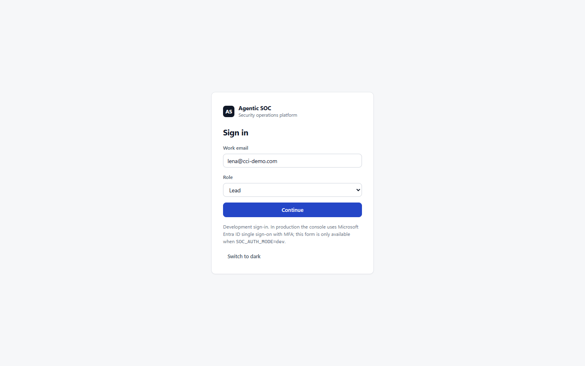 |  | 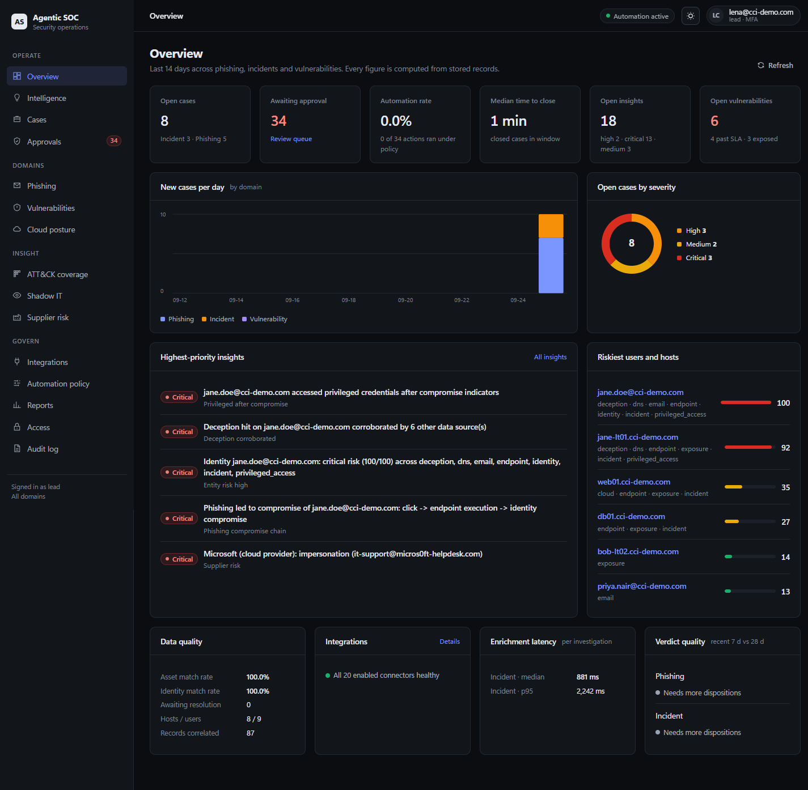 |

**Overview dashboard** - open cases by domain and severity, approvals waiting, automation rate, median time to
close, open insights, open vulnerabilities and SLA breaches, a 14-day trend by domain, the highest-priority
correlated findings, the riskiest users and hosts, data quality (asset / identity match rates, resolution queue),
integration health, **measured enrichment latency** (median and p95 per investigation) and **verdict-quality
drift** against analyst decisions.

Design details: strict Content-Security-Policy (no inline scripts, no third-party resources), all data escaped,
role-aware UI (buttons a user cannot use are hidden - the server enforces the same rules), navigation-race
protection (a slow page can never paint over the page you moved to), accessible focus states, responsive layout.

### 1.2 Shared context store and entity resolution

All tools feed one canonical model: `NormalizedRecord` → entities (assets, identities, indicators) + events
(alerts, sign-ins, DNS, findings, emails...) + relations + evidence, each with source provenance and deep links.

**Asset resolution** (same host across CrowdStrike, Defender, Rapid7, Wiz, Canary, CMDB): deterministic keys
(vendor device ids, serial, MAC, FQDN, cloud resource id) → scored fuzzy matching (hostname, IP-in-time-window,
OS) → unresolved queue → analyst override with audit. Vendor ids are *conflict keys* (two different CrowdStrike
agent ids are never merged); shared hardware ids (cloned-VM serials) need name corroboration; IP-only sightings
are held provisionally and absorbed when a named host claims the IP.

**Identity resolution** (same person across Entra, CrowdStrike `CORP\jdoe`, Defender `userName`+domain, Delinea,
Canary, Umbrella, email): UPN / email / SAM / proxy addresses / former addresses; an authoritative directory
record merges the partial identities it proves identical and absorbs aliases; built-in and machine accounts
(`SYSTEM`, `root`, `HOST$`) never become people; a record that claims another person's address is queued for an
analyst, never merged.

Measured on synthetic estates with realistic defects: **0 false merges** for 400 hosts (cloned serials, reused
IPs, renamed hosts) and 300 people (6 naming conventions, aliases, renames, random arrival order), 0 % identity
splits, 100 % match rate on the sample estate.

### 1.3 Cases, evidence and explainability

Every investigation is a case with a plain-language assessment, **facts separated from inferences**, each claim
citing numbered evidence (hover a reference to see the evidence text and source), MITRE ATT&CK mapping,
completeness (sources that were unavailable are named, never hidden), recommended actions, entities, a unified
timeline across tools, analyst decision capture and the case's audit trail.

| Phishing case | Incident case | Case (dark) |
|---|---|---|
| 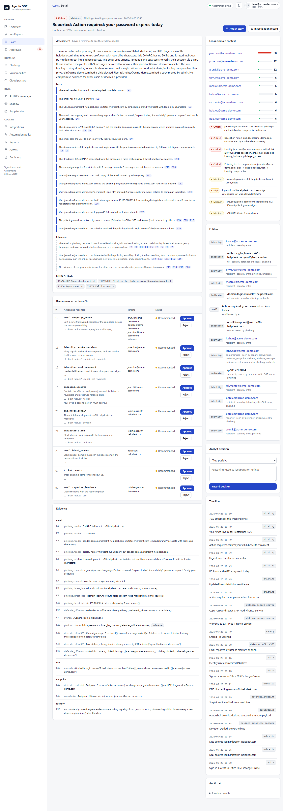 | 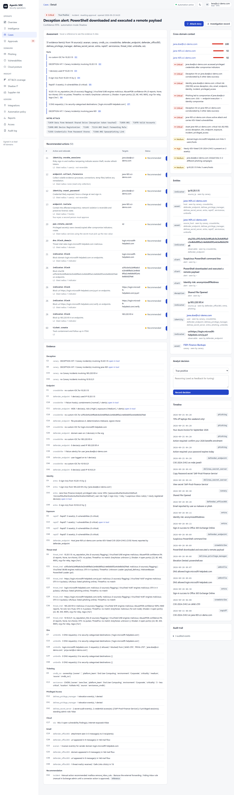 | 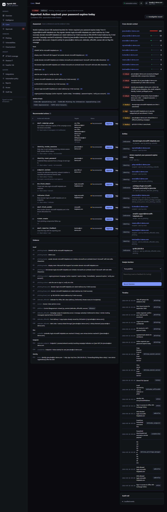 |

### 1.4 Entity 360

One page per user or host across every tool: explainable risk score (each factor with weight, source and time,
decaying with age), identifiers from every tool, cases, correlated findings, vulnerabilities, related users/hosts
and a unified cross-tool timeline.

| Light | Dark |
|---|---|
| 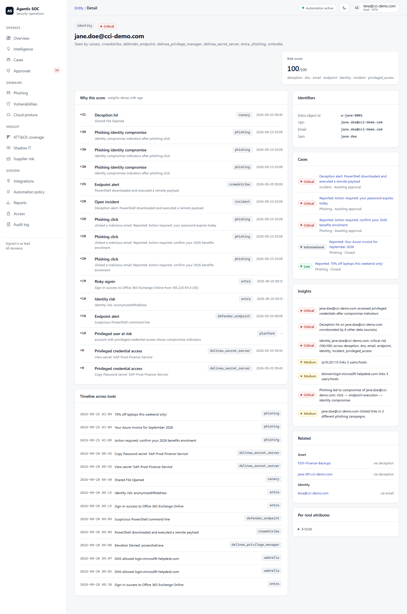 | 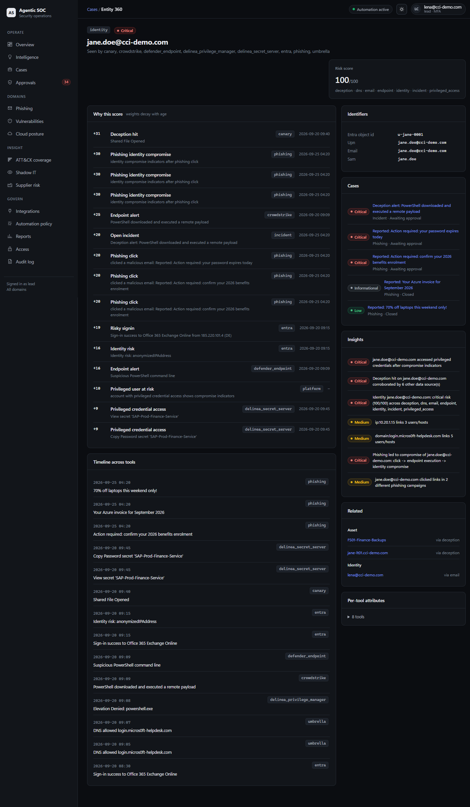 |

### 1.5 Governed automation

* **Autonomy levels L0-L4 per action type** (observe, notify, recommend, approve, autonomous). Default: every
  action is L2 - the platform recommends, a person decides.
* **Gates:** destructive actions are never autonomous; VIP / critical assets and blast radius force approval;
  hard blast-radius limits block; **four-eyes** actions need a second person.
* **Action layer:** pre-conditions re-checked at execution, idempotency keys (replays never duplicate
  containment), multi-vendor routing (e.g. isolate via CrowdStrike *or* Defender), reverse actions / rollback,
  execution records. The same containment recommended by two cases is **one approval**, visible from both.
* **Durable kill switch** - halts all automated actions on every replica immediately, survives restarts.
* **Versioned policy** with propose / approve separation (the proposer cannot approve).

| Approvals | Automation policy |
|---|---|
| 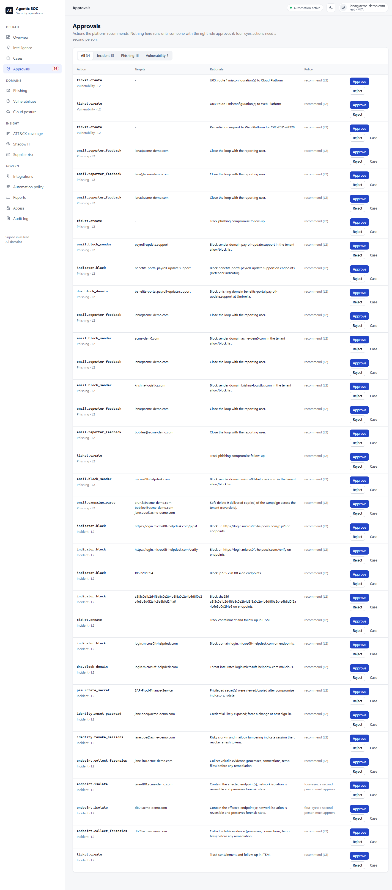 | 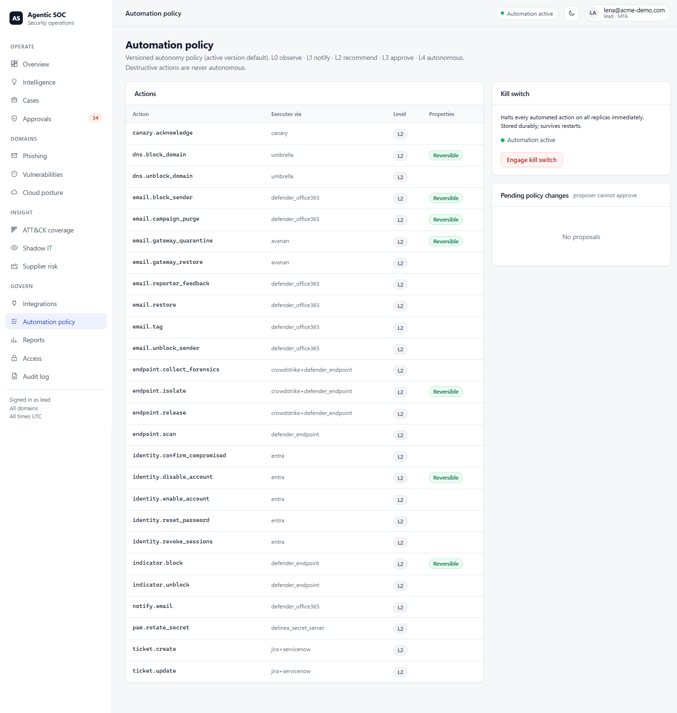 |

### 1.6 Security and access control

* **Authentication:** Microsoft Entra ID (RS256 via tenant JWKS, issuer + audience checked); dev tokens only in
  dev mode and only to the local machine; **service-account API keys** (hashed, expiring ≤ 365 days, shown once);
  **break-glass** access with a sealed secret (only its hash is configured; every use and failed attempt audited
  and raised as a critical insight).
* **Authorisation:** RBAC (analyst, lead, admin, automation admin, auditor) + **domain scoping** (a user can be
  limited to phishing, incident or vulnerability data; cross-domain views need all-domain access) + **step-up
  MFA** for approvals, policy, kill switch and access management + separation of duties everywhere (no
  self-approval of four-eyes actions, policies, exceptions or access grants). Service accounts can never approve.
* **Session control:** per-token revocation (log out) and revoke-all-sessions per user.
* **Platform grants:** time-bound, justified, domain-scoped role assignments on top of Entra roles.
* **Data protection:** raw tool payloads and reported emails **encrypted at rest** (Fernet, key rotation);
  retention job with legal hold for open cases; PII pseudonymised before any LLM call.
* **Audit:** append-only, **hash-chained** audit log (tamper-evident; verification endpoint; JSONL export);
  append-only **access log** of every API call.
* **Web hardening:** strict CSP, security headers, HSTS on TLS, per-client rate limiting (proxy-aware only for
  configured proxies), request-size cap enforced on the byte stream (chunked uploads included), input validation.
* **Supply chain / code:** bandit (0 high / 0 medium), pip-audit (no known vulnerabilities), secrets never in git.

| Access management | Audit log |
|---|---|
| 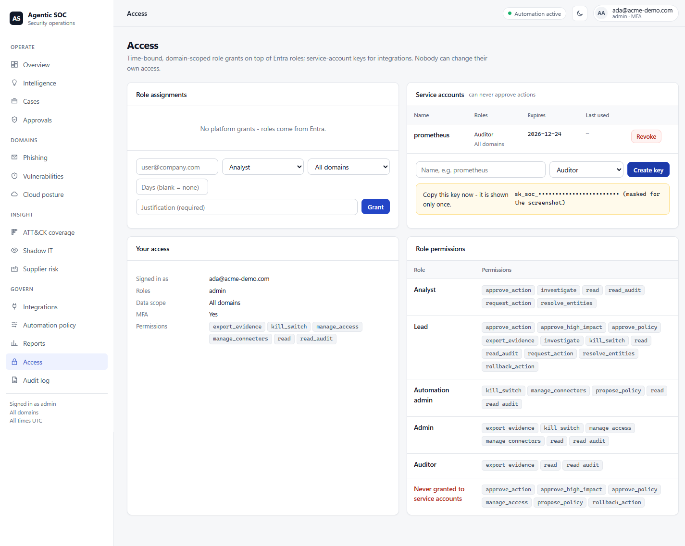 | 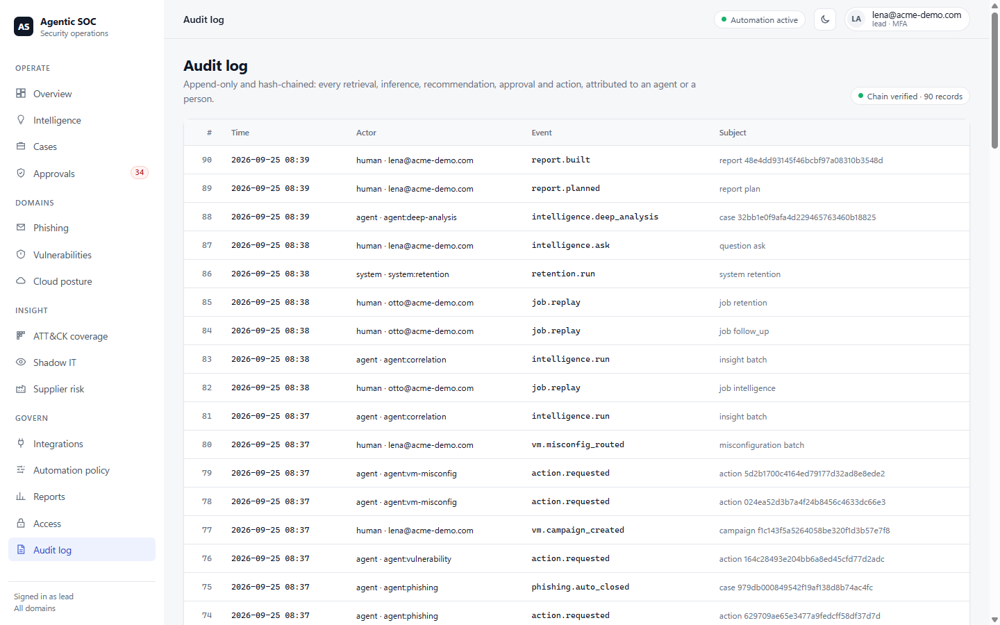 |

---

## 2. Phishing / reported-email module

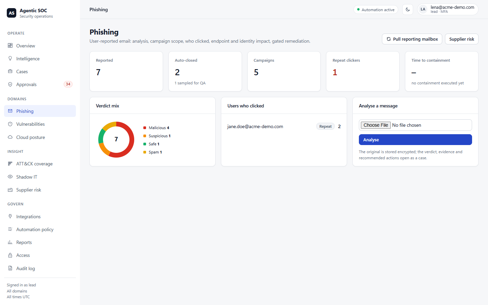

| Capability | What it does |
|---|---|
| Ingestion (PH-F01) | Defender user-reported messages and the SOC reporting mailbox via Graph; manual `.eml` upload; replay-safe |
| Decomposition (PH-F02) | Headers, SPF/DKIM/DMARC/compauth, routing path, bodies, URLs incl. hidden link-text mismatches, attachments, embedded images, **QR codes** |
| Analysis (PH-F03) | Two engines fused: the 7-agent ML swarm (content model, URL, header, attachment static + OCR, sandbox detonation, threat intel, user behaviour) and a deterministic heuristic analyser (look-alike domains incl. homoglyphs, brand impersonation, BEC / payment requests, **bank-detail change**, advance-fee fraud, fake replies, container / macro / ISO attachments, bulk marketing) |
| Control reconciliation (PH-F04) | Compares the platform verdict with Defender for Office 365 and Avanan verdicts and actions; flags missed-by-controls |
| Campaign scope (PH-F05) | Every other recipient of the same or a similar message tenant-wide (message trace + similarity over sender, subject template, URL structure, attachment hash / fuzzy hash, body) |
| User interaction (PH-F06) | Who clicked (Safe Links), whose device reached the site (Umbrella), who replied |
| Endpoint impact (PH-F07) | EDR detections, execution and process activity for clickers (CrowdStrike, Defender) |
| Identity impact (PH-F08) | Risky sign-ins, MFA, new device registrations, inbox forwarding rules (Entra) |
| Explainable verdict (PH-F10) | Counterfactual ("what would change the verdict") and chronological narrative; every claim cited |
| Remediation (PH-F11) | Tenant-wide purge / quarantine, URL and domain blocks (Umbrella, Defender), sender block (Exchange admin API), session revocation - all approval-gated |
| Reporter feedback (PH-F12) | Drafts and (on approval) sends the outcome to the reporting user |
| Bulk triage (PH-F13) | Auto-closes clear benign / spam under policy with mandatory QA sampling |
| Reporting (PH-F14) | Volume, verdict mix, campaigns, repeat clickers, time to containment |
| Indicator propagation (PH-F15) | Confirmed indicators to blocklists (gated) and the shared context store |
| **Supplier / vendor risk (U18)** | For configured key suppliers: authenticated malicious mail (supplier mailbox compromise), payment / bank-detail diversion, supplier look-alike domains, spoofing; high-criticality suppliers escalate; findings become insights |
| Data handling (PH-T06) | Originals encrypted at rest; retention with legal hold; pseudonymisation before LLM |
| Sandbox (PH-T04) | Hardened, fail-closed detonation (no network, read-only root, dropped capabilities, seccomp, non-root, resource limits, host watchdog, optional gVisor); Windows payloads to CAPEv2; no Docker socket in the base deployment |

Measured on the labelled corpus: **100 % detection, 0 % false positives** (20 labelled messages incl. credential
phishing, quishing, HTML attachment, BEC, macro malspam, ISO dropper, supplier bank-change, supplier look-alike,
legitimate vendor, internal and marketing mail).

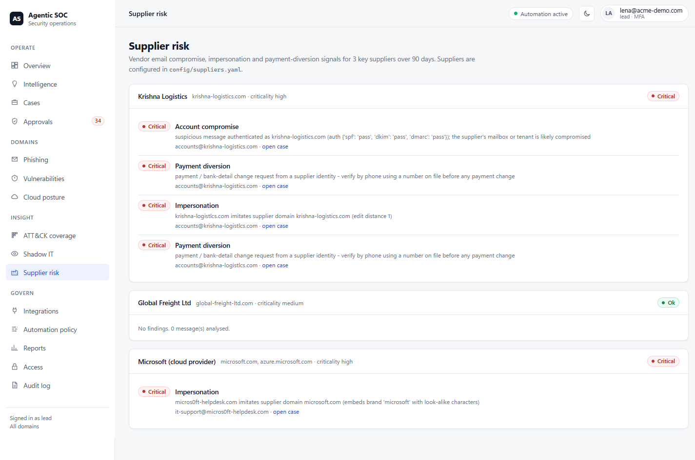

---

## 3. Incident management module

| Capability | What it does |
|---|---|
| Alert ingestion (IM-F01, IM-T02) | CrowdStrike, Defender for Endpoint, Defender for Office 365, Entra Identity Protection, Canary, Wiz, Delinea, Sentinel, plus a webhook for any SIEM/SOAR; cursor-based polling; duplicates suppressed on replay |
| Clustering (IM-F02) | Groups related alerts by entity, time window and technique into one incident; suppresses repeat noise |
| Entity extraction (IM-F03) | Users, hosts, IPs, domains, URLs, hashes, processes, cloud resources |
| Parallel enrichment (IM-F04, IM-T04) | Fan-out across endpoint, identity, privileged access, DNS, deception, exposure, email and threat-intel dimensions with per-source timeouts, caching and per-tool rate budgets (the SOC never overloads a tool's API) |
| Consolidated view (IM-F05) | Entity cards, unified timeline, evidence by dimension, deep links back to each tool |
| Risk assessment (IM-F06) | Deterministic, exposure-informed severity and confidence (an attacked host with a KEV-listed vulnerability ranks higher - U06), MITRE ATT&CK with evidence, grounded summary |
| Recommendations (IM-F07) | Ranked actions with expected impact, blast radius, reversibility and executing tool |
| Guarded response (IM-F09) | CrowdStrike containment, Defender isolation / scan / indicators, Entra session revocation / password reset / disable, Umbrella blocks, Delinea rotation - behind the autonomy policy with rollback |
| Forensics (IM-F10) | Evidence collection via CrowdStrike RTR / Defender investigation package (approval-gated, recommended before containment) |
| Similar incidents (IM-F11, U13) | Past similar incidents with their dispositions and actions |
| Documentation (IM-F12, U15) | Investigation record and evidence pack (Word) from the case and audit trail |
| Shift handover (IM-F13, U05) | Open-incident brief at shift change |
| Detection tuning (IM-F14, U14) | Detections consistently dispositioned false-positive → tuning recommendations |
| Partial results (IM-F15) | Unavailable sources named in every case |
| Canary auto-triage (U04) | Deception hits corroborated across other telemetry |

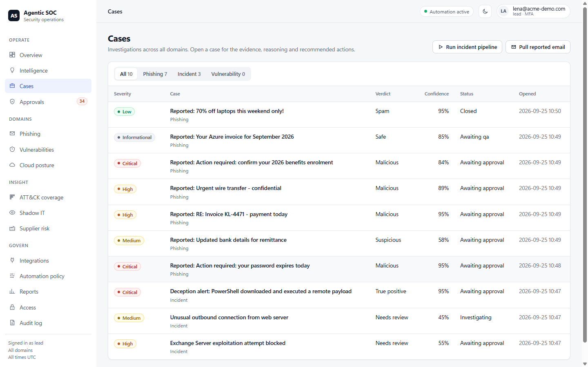

---

## 4. Vulnerability management module

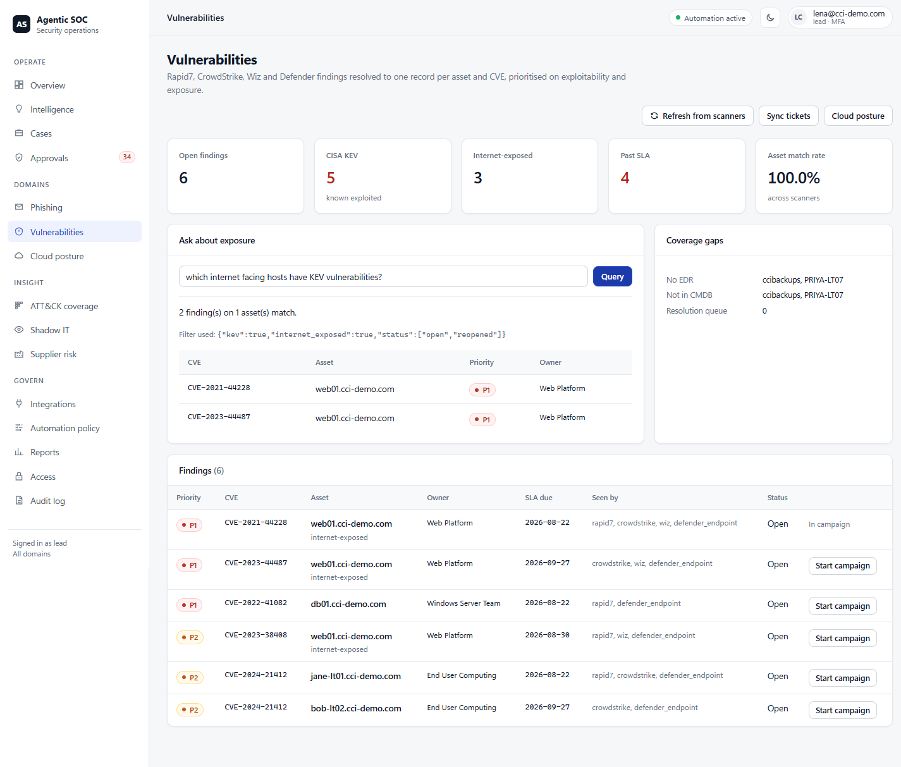

| Capability | What it does |
|---|---|
| Multi-source ingestion (VM-F01) | Rapid7 InsightVM / Nexpose, CrowdStrike Spotlight, Wiz, Defender TVM - scheduled and on demand, incremental with reconciliation |
| Asset resolution + dedup (VM-F02/F03) | One record per asset × CVE across all scanners, every source kept with its status and link |
| Prioritisation (VM-F04) | CVSS + EPSS + CISA KEV + exploit availability + internet exposure + asset criticality → explainable P1-P4 with SLA from first seen |
| Affected devices (VM-F05) | Complete deduplicated asset list per CVE with owner, team, environment, location, priority, status |
| Notifications & routing (VM-F06/F07) | Per-team drafts (assets, rationale, fix, target date) routed via ITSM ticket or SOC mailbox behind approval; unknown owners raised as exceptions |
| Plans & follow-up (VM-F08/F09) | Committed dates, dependencies, acknowledgements; scheduled escalation of unacknowledged / overdue / SLA-breached items |
| **Two-way ITSM sync (VM-T10)** | ServiceNow / Jira ticket state flows back; a resolved ticket triggers re-verification against the scanners; a **false closure** reopens the ticket with the evidence |
| Validation (VM-F10) | Verified remediated / still present / decommissioned / unverifiable; false closures counted |
| Exceptions & risk register (VM-F11/F12) | Justification, compensating control, approver ≠ requester, expiry → auto-reopen; proposed risk-register entries for approval |
| Reports (VM-F13) | Daily exposure report, weekly VM report, management deck - from one dataset |
| Analytics (VM-F14) | Open/closed, MTTR, ageing, SLA breach, regression, per-team performance |
| Natural-language query (VM-F15, U12) | "Which internet-facing hosts have KEV vulnerabilities?" → answer + the exact filter used + records |
| New-CVE / KEV exposure (VM-F16, U02) | Automatic "are we exposed, where, how badly" when a CVE is published or KEV-listed |
| Coverage (VM-F17) | Assets missing EDR or CMDB records, single-scanner assets, stale scans, match rate |
| **Cloud posture (U03)** | Wiz misconfigurations consolidated per resource × rule, owner from CMDB or cloud subscription, SLA by severity (toxic combination on an exposed VM → 3 days), routed as tickets, fix claims validated against Wiz |

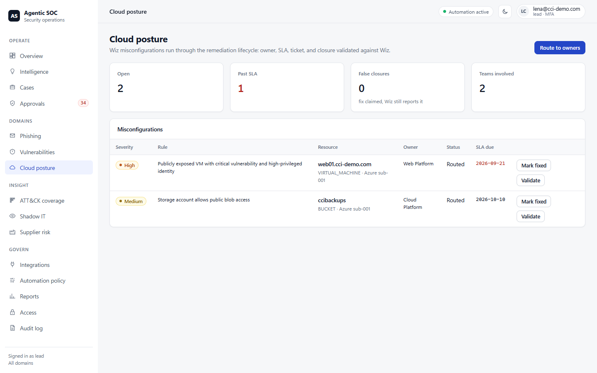

---

## 5. Intelligence layer

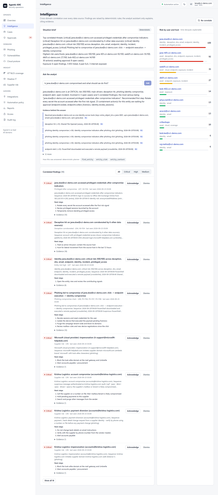

* **Explainable risk engine** - per user and host across all domains, time-decayed, every factor shown.
* **12 correlation rules** raising insights with evidence and next steps (plus three operational alerts: a scheduled job dead-lettered, break-glass access used, platform self-check failing): phishing → endpoint → identity chain
  (U08), privileged access after compromise (U07), deception corroborated (U04), exposed host under attack (U06),
  attacked host without EDR, control gap - a blocked indicator still reachable in another control (U10), repeat
  clickers (U16), new KEV exposure (U02), shared infrastructure, high entity risk, **supplier risk (U18)** and
  **model drift (R14)**.
* **Analyst assistant** - ask in plain language; a planner calls read-only tools (never actions), and the answer
  cites the tool results. Without an LLM the answer is deterministic and still cited; with an approved LLM
  (Azure AI Foundry, Azure OpenAI, Anthropic Claude, OpenAI-compatible) claims are restricted to the cited evidence
  and may not state figures absent from it, PII is
  pseudonymised, prompts are logged, the model is pinned and a token budget applies.
* **Situation brief** for the SOC lead / CISO.
* **ATT&CK coverage (U09)** - capability × observed matrix for the enabled tools, priority blind spots,
  single-source techniques.
* **Shadow IT (U11)** - unsanctioned services (file sharing, generative AI, VPN, remote access) and risky
  destinations from Umbrella, aggregated without storing DNS rows.
* **Drift monitoring (R14)** - agreement with analysts, verdict-mix shift (PSI) and confidence, per domain.

| ATT&CK coverage | Shadow IT |
|---|---|
| 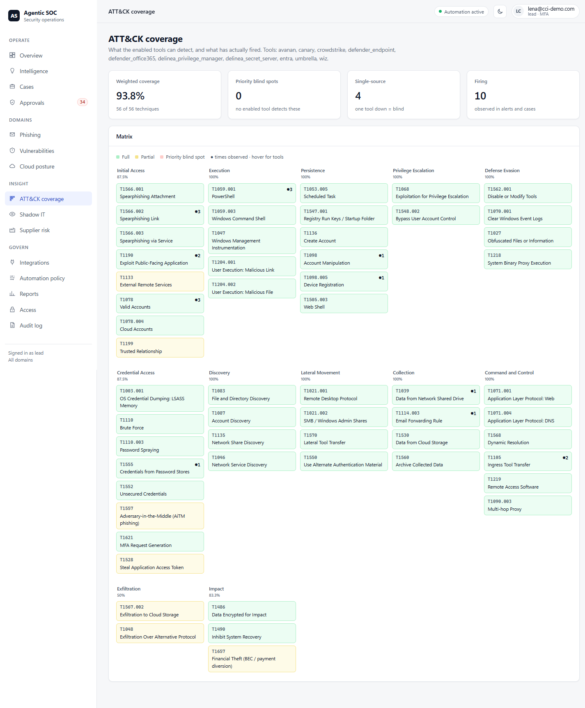 | 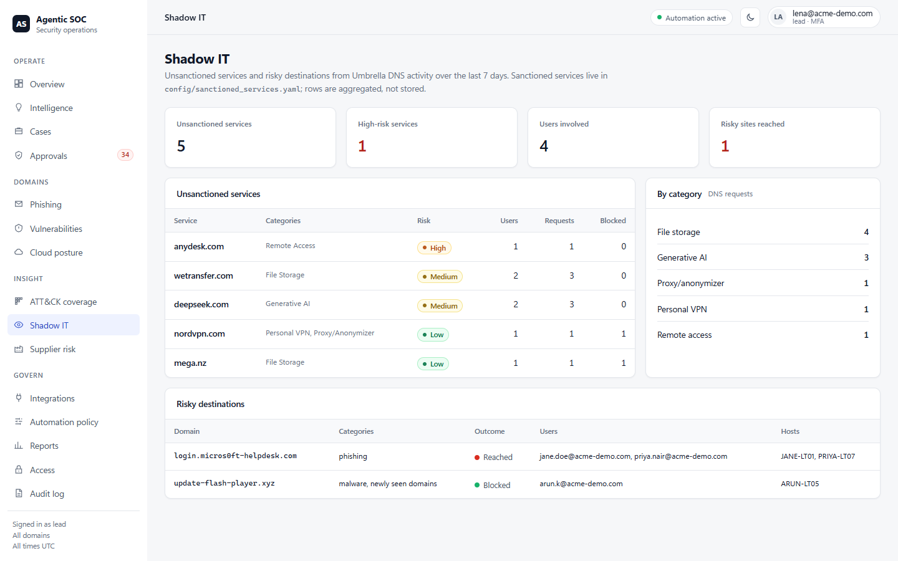 |

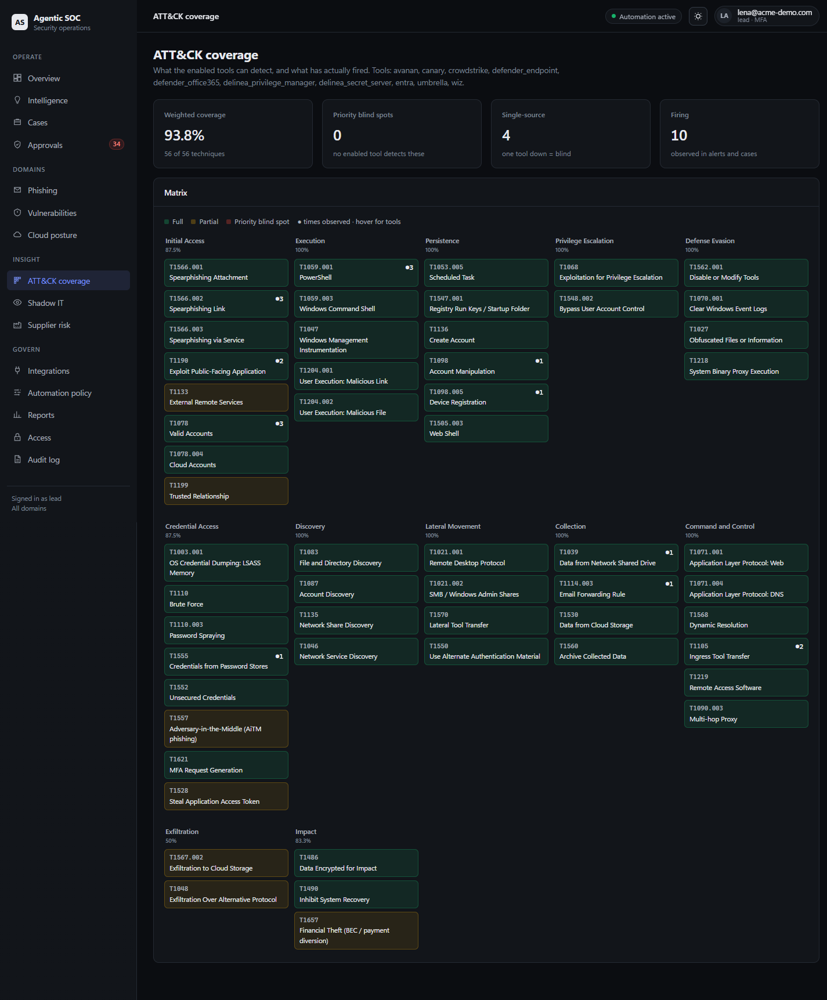

### 5.1 Attack story

Opened from any case ("Attack story" button). One page answers *what happened, how far did it get, what else
could explain it, what did we not see, and what do we do now*, across every connected tool:

* **Kill chain** - each MITRE ATT&CK tactic marked *observed*, *blocked*, *checked, no evidence* or *blind*
  (no connected tool can see it).
* **What happened** - a timeline of steps built only from stored records (email delivery, click, DNS, process,
  sign-in, lateral movement, secret access, persistence, mailbox rules). Each step shows its technique, the tools
  that saw it, the outcome (succeeded / blocked) and a confidence with its reason; every step cites the records
  (S#) it rests on.
* **Benign explanations tested** - "user travelling / VPN", "legitimate admin script", "authorised scanner",
  "normal duties" and others are accepted, rejected or marked unlikely, each with its evidence.
* **Gaps** - stages where nothing was found, naming the tools that were checked.
* **Blast radius** - users who received / interacted, hosts, privileged secrets, related cases, as a graph.
* **Response plan** - pending actions grouped into contain → preserve → eradicate → recover → communicate;
  select and approve in one step. Each action still goes through policy and four-eyes checks.
* The same attack gives the same story from any related case (phishing case, incident case, entity page), and the
  analyst assistant uses it for "what happened to …" questions.

| Attack story | Dark theme |
|---|---|
|  | 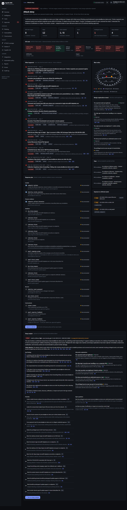 |

### 5.2 Deep analysis (optional LLM)

With an approved LLM endpoint, *Run deep analysis* sends the story's evidence (internal identities pseudonymised)
for a principal-responder review: assessment, likely objective, key findings, alternative explanations, open
questions and priorities. Guardrails: every statement must cite evidence ids from the story or it is removed (the
count is shown); priorities may only reference real pending actions or be marked *manual*; the model's confidence
is compared with the deterministic assessment and disagreement is flagged; results are cached per evidence
fingerprint, logged, and subject to the token budget. Without an LLM the page says so and the story is complete.

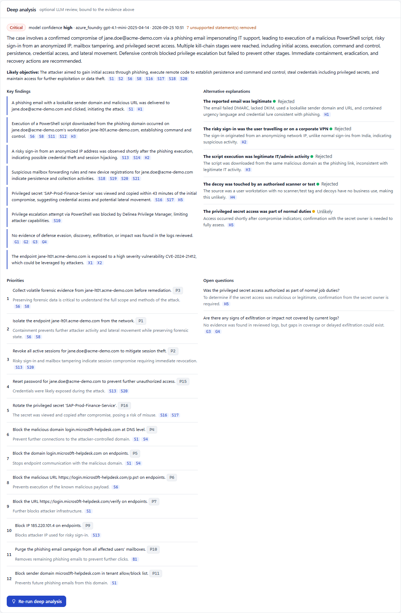

*Real output of Azure AI Foundry gpt-4.1-mini (model and version shown on the card). Note "unsupported statement(s)
removed": statements the model produced without valid evidence were dropped by the guardrail before display.*

---

## 6. Connectors

20 plug-and-play connectors behind one SDK (rate budgets, backoff, cursors, reconciliation, per-record fault
isolation), each with a live mode and a fixture mode running the same code: CrowdStrike Falcon, Microsoft Defender
for Endpoint, Defender for Office 365 (+ Exchange admin API with its own token audience), Entra ID, Rapid7, Wiz
(GraphQL, `issuesV2`, full pagination), Avanan, Cisco Umbrella, Thinkst Canary, Delinea Secret Server, Delinea
Privilege Manager, NIST NVD, FIRST EPSS, CISA KEV, threat-intel fusion (8 sources), ServiceNow (ITSM + CMDB), Jira
(enhanced search with page tokens), CSV / subscription ownership mapping, Microsoft Sentinel, generic SIEM webhook.
Each connector has a **Test** button (authenticates and reads one page) and freshness monitoring against its
stream's expected cadence. Setup and permissions per tool: [CONNECTORS.md](CONNECTORS.md).

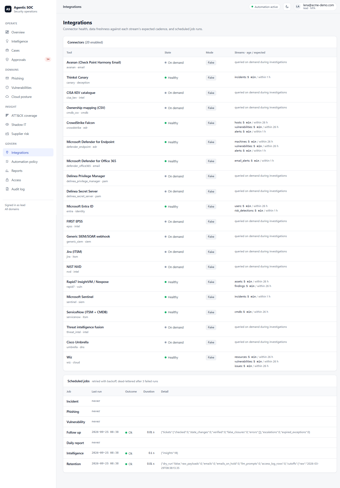

---

## 7. Operations, reporting and compliance

* **Platform self-check** - the platform proves its own numbers: every figure that appears on more than one surface
  (dashboard, approvals badge, analyst answers, brief, report facts) is recomputed through each code path and
  compared; every stored reference is resolved; nothing that must be unique is duplicated; the audit chain is
  verified. Runs hourly (a failure raises a *platform integrity* finding, which resolves itself once consistent),
  on demand at `GET /api/v1/admin/self-check`, and as a card on the Integrations screen.
* **Durable jobs** - every scheduled run recorded; retries with backoff; dead letter after 3 failed runs with an
  alert; database lease so replicas never double-run; replay from the console.
* **Observability** - connector freshness and reconciliation, job health, enrichment latency, drift,
  Prometheus `/metrics` (scraped with an auditor service-account key).
* **Reports** - the [report builder](#71-ai-report-builder) plus fixed exports (daily exposure, weekly VM,
  management deck, investigation records); your own templates plug in.
* **Compliance evidence pack (U17)** - control tests with pass/fail (audit-chain integrity, four-eyes approvals,
  policy change control, MFA and access controls, LLM governance, encryption and retention, kill switch,
  integration freshness) + evidence JSON + full chained audit export + summary document, as one ZIP.

| Reports & compliance pack | |
|---|---|
| 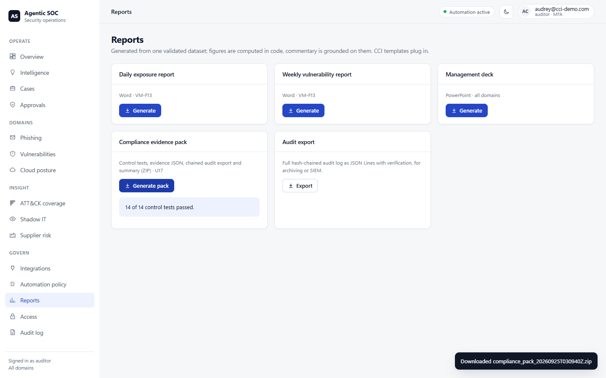 | 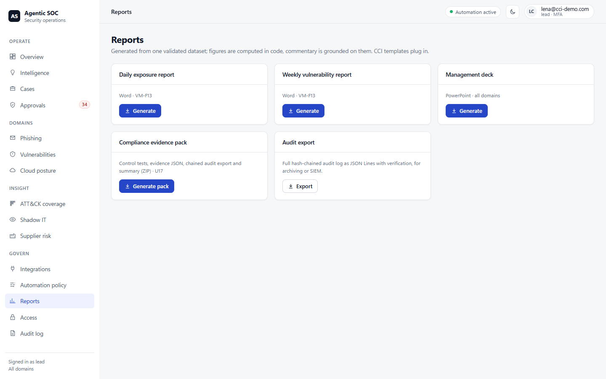 |

### 7.1 AI report builder

* **Standard reports, preconfigured** - board monthly (PowerPoint), CISO weekly, vulnerability weekly, phishing
  and awareness monthly, post-incident report (per case), quarterly control assurance, SOC daily situation report.
* **Any other report, described in words** - e.g. *"a one-page board brief on phishing and supplier risk this
  quarter, as slides"*. A planner (the LLM when configured, keyword rules otherwise) turns the request into sections,
  audience, format and period, using **only** the 16 sources in the data catalogue. You review the plan, then
  generate it, and can save it as a reusable template.
* **Figures are always computed in code** from the platform's records. The LLM writes each section's narrative
  from that section's figures (F#); a sentence that does not cite a figure, or cites one that does not exist, is
  removed. Without an LLM a deterministic writer is used and the figures are identical.
* Every report is limited to the reader's data scope (a vulnerability-only analyst gets only vulnerability
  sections; counts are scoped), audited, and **encrypted at rest**; downloads decrypt and re-check scope.

| Plan from a request | Generated report |
|---|---|
| 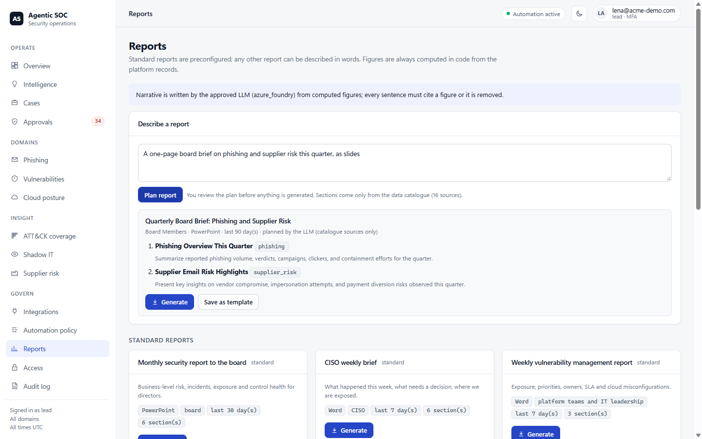 | 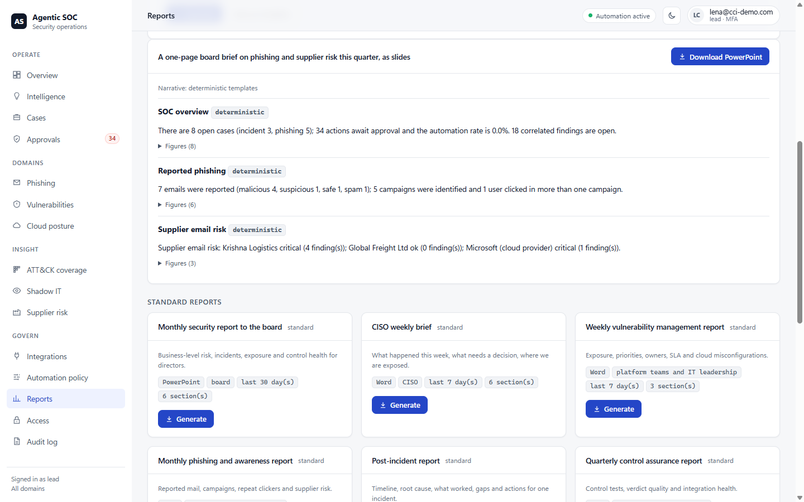 |

---

## 8. Works on any organisation, not just the sample data

`scripts/rename_estate.py` rewrites the whole sample estate into a different organisation ("Northwind Labs":
another domain, people, hosts, IP plan, phishing infrastructure, privileged secrets and suppliers), including
emails embedded as base64 attachments. The generalisation test runs every workflow on both estates - vulnerability
consolidation, cloud posture, incident clustering and investigation, phishing verdicts on the corpus, correlation,
attack story, supplier risk, shadow IT, ATT&CK coverage, the analyst assistant and **all seven standard reports** -
and requires structurally identical results, and **no original name** in any output about the new organisation.
The same script can produce a client-branded demo estate (`SOC_FIXTURES_DIR=<out>/fixtures`).

Beyond renaming, `scripts/build_estate_variant.py` generates **seeded variants with different volumes**: another
organisation, other people, a different machine-naming scheme and IP plan, other suppliers, extra staff, extra
laptops (some with no EDR or missing from the CMDB), extra vulnerable machines, a larger phishing campaign, more
shadow-IT activity and extra benign or bulk mail. The consistency suite, re-run and LLM-parity tests, the self-check,
the browser tour (screen values cross-checked against the API) and the token measurement all run on these variants.
Every API response on a variant is checked to contain no name from the built-in estate.

---

## 9. How it was verified

| Check | Result |
|---|---|
| Platform test suite (unit, integration, API, security, scale, client-demo walkthrough) | see [TEST_REPORT.md](TEST_REPORT.md) |
| Phishing ML engine test suite | 162 passed |
| Browser tour (this document): real server, Chrome, every screen, light + dark, 4 roles | 28 screenshots + 57 screens audited at 1280 / 1024 px: **0 browser errors, 0 server errors, 0 clipped / off-screen / overflowing elements** |
| Feature-by-feature verification (each feature mapped to the tests that prove it) | [FEATURE_VERIFICATION.md](FEATURE_VERIFICATION.md) |
| Identity / asset resolution stress tests | 0 false merges |
| Labelled phishing corpus | 100 % detection, 0 % false positives |
| Static security analysis / dependency audit | bandit 0 high / 0 medium; pip-audit clean |
| Requirements coverage | every requirement ID mapped in [REQUIREMENTS_TRACEABILITY.md](REQUIREMENTS_TRACEABILITY.md) |

**Scope note.** The sample estate exercises every workflow through the same code as production. What it cannot
show is behaviour against the client's own tenants and volumes: each vendor connector must be connected and tested in
the client's environment, and accuracy / latency targets measured on the client's data (see DEMO_GUIDE.md).
