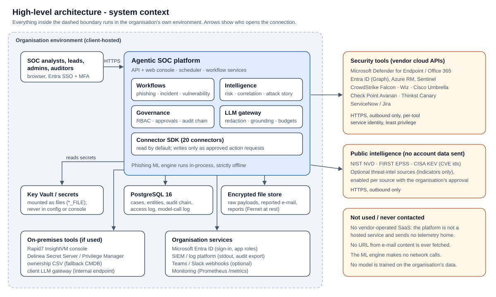
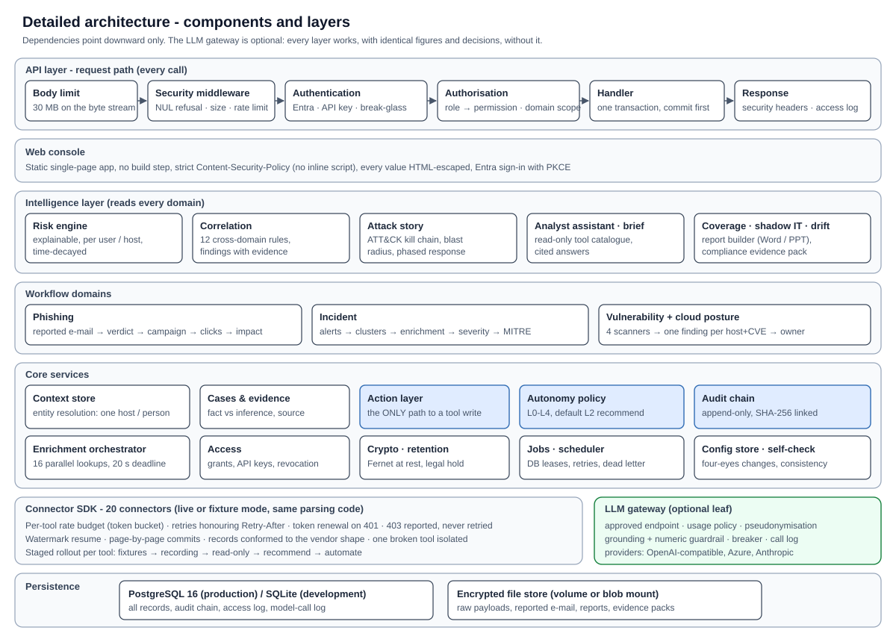
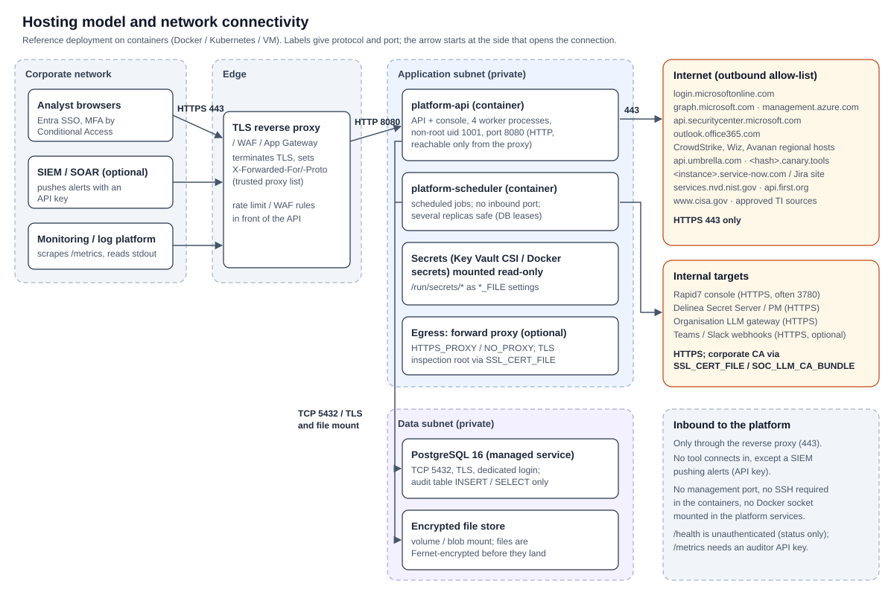

# Solution architecture

| | |
|---|---|
| **Document** | Solution architecture - Agentic SOC platform |
| **Version** | 1.0 - 2026-10-10 |
| **Audience** | Enterprise / security architecture, infrastructure and network teams |

**Status terms used in this document:** *Implemented* - built, enforced in code and covered by automated tests that
run on every build; *Configured at deployment* - built, with the value chosen by or taken from the organisation's
environment; *To validate in the organisation's environment* - built and tested against vendor-shaped data, not yet
exercised against the organisation's own tenants, volumes or users (covered by the pilot).

## 1 Summary

- The platform is **client-hosted**: it runs in the organisation's own environment (containers on the organisation's
  Kubernetes, Docker hosts or VMs; Windows hosts are also supported). It is not a vendor-operated SaaS and sends no
  data or telemetry to its developers.
- It consists of **two application services** (API with web console; scheduler), **one PostgreSQL database** and
  **one encrypted file store**. There is no message bus, cache cluster or agent to install on endpoints.
- It accepts inbound traffic **only through the organisation's TLS reverse proxy**. All integration traffic is
  **outbound HTTPS** to the security tools' APIs, initiated by the platform; no tool connects in (except an optional
  SIEM pushing alerts with an API key).
- Every write to a security tool goes through one **action layer** governed by an autonomy policy whose default is
  *recommend*: a person approves each action.
- An optional LLM is reached only through the **organisation's own LLM gateway**; everything works without it.

## 2 High-level architecture

| Element | Role |
|---|---|
| SOC users | Analysts, leads, administrators and auditors use a browser; sign-in is Microsoft Entra ID single sign-on with MFA; roles come from Entra app roles |
| Agentic SOC platform | Ingests from the tools, resolves entities, runs the three workflows and the intelligence layer, presents cases and recommendations, executes approved actions, records everything in a tamper-evident audit chain |
| Security tools | Read through their documented APIs with a dedicated, least-privilege service identity per tool; written to only for action types the organisation approves |
| Organisation services | Entra ID (sign-in, app roles), the vault holding secrets, the SIEM / log platform receiving logs and audit exports, monitoring, optional Teams / Slack notifications, the LLM gateway |
| Public intelligence | NIST NVD, FIRST EPSS and CISA KEV for vulnerability context (only CVE identifiers are sent); optional threat-intelligence sources, each enabled only with the organisation's approval |

## 3 Detailed architecture

**Layering.** Dependencies point downward only: the API composes the intelligence layer, which reads the workflow
domains, which use the core services, which use the connectors. The LLM gateway is a leaf any layer may call, and
every layer works - with identical figures and decisions - when it is switched off.

| Layer | Components | Responsibility |
|---|---|---|
| API and console | FastAPI application, static single-page console | Authentication, authorisation, input limits, rate limiting, security headers, access log; the console is static files served by the same process (no separate web server, no build-time dependencies at run time) |
| Intelligence | Risk engine, 12 correlation rules, attack story, analyst assistant, situation brief, ATT&CK coverage, shadow IT, drift monitoring, report builder, compliance evidence pack | Cross-domain analysis on the shared picture; every figure computed in code |
| Workflow domains | Phishing, incident, vulnerability (with cloud posture) | Case building, enrichment, deterministic scoring, recommendations |
| Core services | Context store and entity resolution; cases and evidence; enrichment orchestrator; action layer; autonomy policy; audit chain; access management; encryption and retention; jobs and scheduler; connector configuration store; self-check | The governed foundation every workflow uses |
| Connector SDK | 20 connectors | Uniform, rate-limited, resumable access to each tool; fixture mode for testing with the same parsing code |
| LLM gateway (optional) | Providers for OpenAI-compatible gateways, Azure OpenAI / AI Foundry and the Claude Messages API | Usage policy, pseudonymisation, approved-endpoint enforcement, grounding and numeric guardrails, circuit breaker, call log |
| Persistence | PostgreSQL 16; encrypted file store | All records; raw payloads, reported e-mail and generated reports encrypted before they are written |

**Request path.** Every API call passes, in order: a 30 MB body limit enforced on the byte stream; a security
middleware (NUL characters refused, size checked, per-client rate limit 20 requests/s with a burst of 120); token or
API-key authentication with revocation checks; a permission check that also applies the user's data scope; the
handler, inside one database transaction that commits **before** the response is sent; security headers and an
access-log entry on the way out.

**Processing model.** Network work (tool calls, model calls) runs in parallel threads; database work stays sequential
on the calling thread and parallel results are merged in a fixed order, so the same input always gives the same
output. Every outbound call goes through the tool's request budget (a token bucket), so parallelism never exceeds the
rate a vendor allows.

## 4 Hosting model

| Aspect | Design |
|---|---|
| Where | The organisation's environment: a container platform (Kubernetes / AKS, Docker hosts) or VMs; Linux containers recommended; Windows supported |
| Who operates | The organisation (or its appointed operator); the platform needs no inbound access for its developers |
| Tenancy | Single organisation per deployment; no shared multi-tenant components |
| Image | Multi-stage build on `python:3.11-slim`; runs as a non-root user (uid 1001); health check on `/health`; the phishing ML engine is included by a build argument |
| Configuration | Environment variables plus `config/connectors.yaml`; secrets as files mounted from the vault (`<NAME>_FILE`); every setting is validated at start-up and a wrong value refuses the start with the fix |
| Upgrades | New image tag; start-up creates new tables, adds new nullable columns and widens text columns automatically; a change needing a scripted migration is announced with its script |

**Reference deployment** (from `deploy/docker-compose.yml`, verified end to end on Docker Desktop on 2026-10-07):

| Service | Purpose | Notes |
|---|---|---|
| `platform-api` | API and console | 4 worker processes by default (`SOC_API_WORKERS`, one per CPU core given); stateless - any number of replicas behind the proxy; graceful shutdown lets requests in flight finish |
| `platform-scheduler` | Scheduled jobs (ingestion, investigation, correlation, retention, self-check, reports, notifications) | Several replicas are safe: the database decides what is due and a per-job lease prevents concurrent runs; stops between jobs on SIGTERM |
| `postgres` | PostgreSQL 16 | In production a managed service with TLS, backups and point-in-time recovery |
| Volume | Encrypted file store | Persistent volume or blob mount |

The compose file also contains an optional `engine` profile (the phishing ML engine's original microservices with
RabbitMQ and Redis). **It is not needed**: the platform runs the trained models in-process and offline.

## 5 Infrastructure components

| Component | Requirement | Owner |
|---|---|---|
| Container runtime / orchestrator | Docker or Kubernetes able to run Linux containers; CPU cores per API replica = worker count | Organisation |
| PostgreSQL 16 | Dedicated database and login; TLS; backups with a tested restore; `max_connections` above `workers x (SOC_DB_POOL_SIZE + SOC_DB_MAX_OVERFLOW)` (defaults 20 + 20 per process) | Organisation |
| Persistent storage | Volume / blob for encrypted raw payloads, reported e-mail and reports | Organisation |
| Secrets vault | Azure Key Vault or equivalent, mounted as files into the containers | Organisation |
| TLS reverse proxy / WAF | Terminates TLS (443) in front of the API; its address is listed in `SOC_TRUSTED_PROXIES` | Organisation |
| Identity provider | Microsoft Entra ID: one app registration (API + console), app roles, Conditional Access requiring MFA | Organisation |
| Forward proxy (optional) | `HTTPS_PROXY` / `NO_PROXY`; with TLS inspection, the inspecting root CA supplied via `SSL_CERT_FILE` | Organisation |
| Log collection | Container stdout (JSON lines in production) into the organisation's log platform / SIEM | Organisation |
| Monitoring | Prometheus-compatible scrape of `/metrics` with an auditor API key; `/health` for load balancers | Organisation |
| LLM gateway (optional) | The organisation's in-house endpoint in front of its approved models | Organisation |

**Measured capacity** (laptop test bed - to be re-measured on the target environment during the pilot with the
included `scripts/load_test.py` and `scripts/measure_scale.py`):

| Measure | Result |
|---|---|
| Concurrent analysts | 4 API processes served 100 simulated analysts at 150 requests/s with no error or timeout (PostgreSQL 127 requests/s, also no error); a single screen takes 6-50 ms on its own |
| Ingestion | About 146 records/s on SQLite and about 75 on PostgreSQL, flat as the estate grows (29 SQL statements per record at every size tested up to 21,675 records) |
| Saturation | All database connections busy, or the database briefly unreachable, answers 503 with `Retry-After` - not a hang and not a server error |

## 6 Network connectivity requirements

### Inbound

| From | To | Protocol / port | Purpose |
|---|---|---|---|
| Analyst browsers | Reverse proxy | HTTPS 443 | Console and API |
| SIEM / SOAR (optional) | Reverse proxy | HTTPS 443 | Alert push (`POST /api/v1/ingest/alerts`, API key) |
| Monitoring | Reverse proxy (or internal service address) | HTTPS 443 | `/metrics` (auditor API key), `/health` |
| Reverse proxy | `platform-api` | HTTP 8080 (private network only) | Forwarded requests; the API trusts `X-Forwarded-For` / `-Proto` only from listed proxies |

Nothing else is inbound: no tool connects to the platform, the containers need no SSH or management port, and the
platform services do not mount the Docker socket.

### Internal

| From | To | Protocol / port |
|---|---|---|
| `platform-api`, `platform-scheduler` | PostgreSQL | TCP 5432 with TLS |
| `platform-api`, `platform-scheduler` | File store | Volume / blob mount |
| `platform-api`, `platform-scheduler` | Vault | Secrets mounted read-only as files (no runtime vault API call needed) |

### Outbound (allow-list)

All outbound connections are HTTPS (443 unless the internal tool uses another port) and are opened by the platform.
Only the hosts of the tools the organisation enables are needed.

| Destination | Used by |
|---|---|
| `login.microsoftonline.com` | Entra sign-in token validation keys; every Microsoft connector's token |
| `graph.microsoft.com`, `management.azure.com` | Entra ID, Azure role assignments, Sentinel, Defender for Office 365 |
| `api.securitycenter.microsoft.com` (or the regional host) | Defender for Endpoint |
| `outlook.office365.com` | Defender for Office 365 (Tenant Allow/Block List actions) |
| The CrowdStrike API host of the organisation's cloud | CrowdStrike Falcon |
| The Wiz API and authentication hosts | Wiz |
| The Check Point regional gateway | Avanan |
| `api.umbrella.com` | Cisco Umbrella |
| `<hash>.canary.tools` | Thinkst Canary |
| `<instance>.service-now.com` or `<site>.atlassian.net` | ServiceNow / Jira |
| `services.nvd.nist.gov`, `api.first.org`, `www.cisa.gov` | Public vulnerability intelligence |
| Approved threat-intelligence sources only | Indicator enrichment (optional) |
| Internal: Rapid7 console (often port 3780), Delinea servers, the LLM gateway, Teams / Slack webhooks | Rapid7, Delinea, narrative, notifications |

**No other destination is contacted.** In particular the platform never fetches a URL found in e-mail content (there
is no server-side request forgery surface), the phishing ML engine makes no network calls, and nothing is sent to the
platform's developers. TLS certificates are verified on every call; internally issued certificates are trusted by
supplying the organisation's CA bundle (`SSL_CERT_FILE`, `SOC_LLM_CA_BUNDLE`), never by disabling verification.

## 7 Availability, resilience and recovery

| Concern | Design | Status |
|---|---|---|
| API availability | Stateless replicas behind the proxy; container health check; graceful shutdown | Implemented |
| Scheduler availability | Runs inside the API by default or as its own service; any number of replicas; heartbeat on `/health`; a "scheduler stopped / stuck" banner on every screen | Implemented |
| Job failures | Retries with back-off; dead letter after 3 failed runs raises a finding; replay from the console | Implemented |
| A tool down | That tool's evidence is shown as *unavailable* by name; workflows continue; a verdict is never silently changed | Implemented |
| A tool misconfigured | Isolated from every workflow with the reason; all other tools keep working | Implemented |
| LLM down | Circuit breaker; deterministic text immediately; no figure or decision changes | Implemented |
| Database saturation / failover | Connection pool with pre-ping and recycling; 503 with `Retry-After`; optional statement timeout | Implemented |
| Backup and restore | Database point-in-time backups plus the file-store volume; after restore `GET /api/v1/audit/verify` proves the audit chain intact | Configured at deployment |
| Recovery targets (RPO / RTO) | Determined by the organisation's database backup policy and orchestration | Configured at deployment |

## 8 Technology stack

| Component | Technology |
|---|---|
| Language / runtime | Python 3.11 |
| Web framework / server | FastAPI, Uvicorn |
| Data access | SQLAlchemy 2.0 (same code on PostgreSQL and SQLite) |
| Database | PostgreSQL 16 (production); SQLite (development and demonstrations only) |
| HTTP client | httpx (timeouts, connection pooling, TLS verification) |
| Tokens | PyJWT (RS256 / JWKS validation), MSAL |
| Cryptography | `cryptography` Fernet / MultiFernet (AES-128-CBC + HMAC-SHA256, key rotation) |
| Documents | python-docx, python-pptx |
| Console | Vanilla JavaScript, no framework and no runtime npm dependencies |
| ML engine (optional) | scikit-learn, XGBoost, LightGBM, LangGraph (no GPU, no PyTorch) |
| Quality gates | ruff, bandit, pip-audit, automated test suites on SQLite and PostgreSQL, Playwright browser tour with axe-core accessibility scan |
