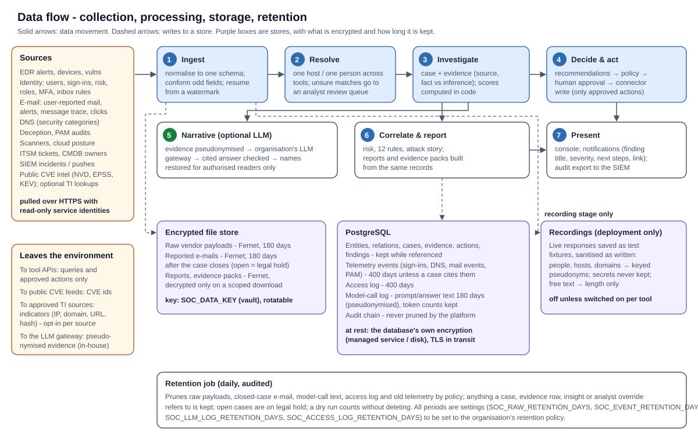

# Data flow and protection

| | |
|---|---|
| **Document** | Data flow and protection - Agentic SOC platform |
| **Version** | 1.0 - 2026-10-10 |
| **Audience** | Data protection, privacy, security architecture, records management |

## About the platform

The Agentic SOC platform is an investigation and automation layer that runs inside the organisation's own environment,
on top of the security tools it already owns (EDR, e-mail security, identity, DNS, deception, privileged access,
vulnerability scanners, cloud posture, ITSM / CMDB, SIEM). It reads from those tools through their APIs, resolves every
record to one host or one person, and runs three workflows - reported phishing, incident management and
vulnerability management - plus a cross-domain intelligence layer. Every change it makes to a security tool is an
*action request* that passes through one governed action layer and a versioned *autonomy policy*, whose default is
**recommend**: a person approves each action. An optional large language model, reached only through the
organisation's own LLM gateway, writes explanatory narrative but never produces a figure, verdict, score or decision.

**Status terms used in this document:** *Implemented* - built, enforced in code and covered by automated tests that
run on every build; *Configured at deployment* - built, with the value chosen by or taken from the organisation's
environment; *To validate in the organisation's environment* - built and tested against vendor-shaped data, not yet
exercised against the organisation's own tenants, volumes or users (covered by the pilot).

## 1 Summary

- **All data stays in the organisation's environment.** The platform's database and file store are hosted by the
  organisation; nothing is sent to the platform's developers.
- **What leaves the environment** is limited and listed in section 7: queries and approved actions to the
  organisation's own security tools, CVE identifiers to public vulnerability feeds, external indicators to
  threat-intelligence sources the organisation approves (internal addresses and the organisation's own domains are
  never sent), and pseudonymised evidence to the organisation's own LLM gateway.
- **Encryption:** TLS on every connection; raw vendor payloads, reported e-mails, generated reports and evidence packs
  are encrypted by the platform (Fernet, rotatable keys) before they are written; the database relies on the
  organisation's database encryption at rest.
- **Minimisation:** only security-relevant data is collected (for example DNS is stored only for security
  categories); free text is bounded; telemetry is pruned after a configurable period; AI prompts carry pseudonyms,
  not identities.
- **Retention** is configurable per data class and applied by a daily, audited job; anything an open case or a
  finding relies on is kept.

## 2 Data flow

| Step | What happens | Data protection points |
|---|---|---|
| 1. Ingest | Each connector reads a page from the tool's API, normalises each record into one canonical schema and stores it; the original payload is kept as an encrypted copy | Read-only service identity; HTTPS; payload encrypted before it is written; malformed fields emptied rather than guessed |
| 2. Resolve | Records naming the same host or person are linked to one entity (deterministic keys first; scored fuzzy matching; unsure matches go to an analyst review queue) | Resolution never merges on a single weak signal; built-in accounts (SYSTEM, root, machine accounts) are never treated as people |
| 3. Investigate | A case is built with evidence rows (source tool, fact or inference, deep link); severity, verdict and priority are computed in code | Evidence carries its provenance; each case belongs to one domain and is visible only to users with that domain in scope |
| 4. Decide and act | Recommendations become action requests; a person approves; the connector performs the write | Only approved actions reach a tool; every step is in the audit chain |
| 5. Narrative (optional) | The evidence of one item is pseudonymised and sent to the organisation's LLM gateway; the cited answer is checked and names are restored for the reader | Pseudonymisation before the prompt leaves; prompts stored pseudonymised; text purged after the retention period |
| 6. Correlate and report | Risk, correlation rules and the attack story are computed from the stored records; reports and evidence packs are generated from the same records | Reports are encrypted when written and decrypted only on an authorised, scope-checked download |
| 7. Present | Console; notifications for findings above a threshold; audit export to the organisation's SIEM | Screens, exports and the audit and access logs are filtered by the user's domain scope |

## 3 Data inventory

| Data category | Source tools | Typical content | Personal data | Purpose |
|---|---|---|---|---|
| Identities | Entra ID, CMDB, all tools naming users | Name, UPN / e-mail, department, manager, roles, MFA methods, account state | Yes (workforce) | Know who is affected, who owns what, who is privileged |
| Sign-ins and identity risk | Entra ID | Time, user, IP address, location, device compliance, Conditional Access result, risk detections | Yes | Detect compromised accounts |
| Endpoint data | Defender for Endpoint, CrowdStrike | Host name, IP, OS, logged-on user, alerts with process / file / network evidence | Yes (host-to-user link) | Incident investigation, containment |
| E-mail | Defender for Office 365, Avanan | User-reported messages in full (headers, body, attachments), message trace metadata, URL click events, verdicts | Yes (sender, recipients, content) | Phishing analysis, campaign scope, who clicked |
| DNS activity | Umbrella | Queried domain, verdict, category, internal IP, identity - **security categories only by default** | Yes | Did a user reach a malicious site; shadow IT |
| Privileged access | Delinea | Who opened which secret or session, elevation events | Yes | Privileged misuse detection |
| Deception | Canary | Alerts on decoys and tokens: source IP, host | Possibly | High-fidelity intrusion signal |
| Vulnerabilities and cloud posture | Rapid7, Wiz, Defender TVM, CrowdStrike Spotlight | Asset, CVE, severity, exposure, fix text, cloud resource, misconfiguration | Indirect (asset owner) | Prioritised remediation |
| Ownership and tickets | ServiceNow / Jira / CSV | CI owner, support group, criticality, ticket status | Yes (owner names) | Route work to the right team |
| Public intelligence | NVD, EPSS, CISA KEV, approved TI sources | CVE scores, exploitation status, indicator reputation | No | Context and prioritisation |
| Platform records | The platform | Cases, evidence, actions, approvals, insights, notes, audit chain, access log, model-call log | Yes (analysts, subjects) | Workflow, accountability, audit |

## 4 Storage

| Store | Content | Protection | Location |
|---|---|---|---|
| PostgreSQL | Entities and relations, normalised records, cases, evidence, actions, findings, insights, policies, access grants, connector configuration versions, audit chain, access log, model-call log | Organisation's database encryption at rest; TLS; a dedicated login; the audit table should be granted INSERT / SELECT only; the platform refuses UPDATE and DELETE on audit and access-log records | Organisation's data subnet |
| Encrypted file store | Raw vendor payloads; reported e-mail files; generated reports, post-incident reports and compliance evidence packs | Encrypted by the platform before writing (Fernet: AES-128-CBC with HMAC-SHA256 authentication); written atomically with owner-only permissions; decrypted only for an authorised, scope-checked download | Organisation's volume / blob store |
| Recordings (deployment only) | Sanitised copies of live API responses, used as test fixtures during onboarding | Off unless a tool is in the Recording stage; sanitised as written (section 9) | A folder the organisation chooses |
| Attack stories | Not stored - rebuilt from records on request; only a deep-analysis result is cached on the case | - | - |

## 5 Encryption

| Where | How | Status |
|---|---|---|
| Browser to platform | TLS at the organisation's reverse proxy; HSTS; strict security headers | Configured at deployment (proxy), implemented (headers) |
| Platform to tools, feeds, LLM gateway, webhooks | HTTPS with certificate verification; corporate CA bundles supported; verification is never disabled for the gateway | Implemented |
| Platform to database | TLS to PostgreSQL | Configured at deployment |
| Files at rest | Fernet via MultiFernet. `SOC_DATA_KEY` holds one or more keys: the first encrypts, all decrypt, so keys rotate without bulk re-encryption; mandatory in production (the platform refuses to start without it) | Implemented |
| Database at rest | The organisation's database encryption (managed-service or disk encryption) | Configured at deployment |
| Secrets | In the organisation's vault, mounted as files; never in configuration, the database or logs; the console shows *set / not set* only | Implemented |
| Backups | Database point-in-time backups and the file-store volume (files remain Fernet-encrypted inside backups); keep the data keys in the vault, separate from backups | Configured at deployment |

## 6 Retention and deletion

A retention job runs daily (also on demand, with a dry run that counts without deleting). Every run is recorded in the
audit chain with what it removed.

| Data class | Default | Setting | Rule |
|---|---|---|---|
| Raw vendor payloads | 180 days | `SOC_RAW_RETENTION_DAYS` | The normalised record stays (cases and figures are built from it) |
| Reported e-mail files | 180 days after the case is closed | `SOC_RAW_RETENTION_DAYS` | The file of any open case is kept (automatic legal hold) |
| Telemetry events (sign-ins, DNS, mail events, secret accesses, elevations) | 400 days | `SOC_EVENT_RETENTION_DAYS` (0 = keep) | Kept while a case, evidence row, insight or analyst override refers to it; alerts, findings, assets, people and indicators are not pruned by this rule |
| Model-call log: prompt and answer text | 180 days | `SOC_LLM_LOG_RETENTION_DAYS` | Token counts and metadata are kept for budget reporting |
| Access log | 400 days | `SOC_ACCESS_LOG_RETENTION_DAYS` | Every API request: who, method, path, status, client address, user agent, latency |
| Audit chain | Never pruned by the platform | - | Export (JSON Lines with chain verification) to the organisation's archive / SIEM for long-term retention |
| Generated reports | Kept until removed by the operator | - | Encrypted at rest |
| Backups | The organisation's policy | - | - |

**Limitations to note.** Legal hold is automatic for the material of open cases; there is no separate manual
legal-hold flag on individual records. There is no per-person erasure function: a data-subject request would be
served by the retention rules and, where needed, by a database procedure run by the operator. The organisation should
set the periods above to its own security-evidence retention policy before go-live.

## 7 Data transfers outside the organisation's environment

| Destination | What is sent | Why | Control |
|---|---|---|---|
| The organisation's security tools (vendor clouds) | API queries; for approved actions, the action and its targets | Read data; perform approved responses | Per-tool least-privilege identity; writes only through approved action requests |
| NIST NVD, FIRST EPSS, CISA KEV | CVE identifiers (or nothing - the KEV catalogue is downloaded whole) | Vulnerability scores and exploitation status | No organisation data beyond CVE ids |
| Approved threat-intelligence sources (opt-in per source) | External indicators: public IP addresses, external domains and URLs, file hashes | Reputation of indicators in alerts and reported e-mail | Used only for sources whose key the organisation configures. **Private, loopback, link-local and reserved addresses, single-label and private-suffix host names, and anything under the organisation's own domains are never sent** (they are marked "not checked"). E-mail bodies, user names and internal host names are never sent |
| The organisation's LLM gateway (in-house) | The evidence of one item, pseudonymised (internal e-mail addresses, known names, phone numbers, national identifiers and card numbers replaced by tokens) | Explanatory narrative | Approved-endpoint allow-list; usage policy; nothing is sent when the LLM is off |
| Teams / Slack / webhook (optional) | Finding title, severity, up to three next steps and a link to the console | Alerting | Destinations only from configuration and HTTPS-only. **Finding titles can name a user or host** (for example "Phishing led to compromise of <user>"): route them to channels approved for that information |
| The organisation's SIEM / log platform | Structured logs; audit export | Monitoring and archiving | Logs carry no secrets, query strings or request bodies |

Not transferred: no data or telemetry to the platform's developers; no URL found in e-mail content is ever fetched;
the phishing ML engine makes no network calls; no model is trained or fine-tuned on the organisation's data.

## 8 Privacy by design

| Measure | Detail | Status |
|---|---|---|
| Data residency | Every store is in the organisation's environment; the LLM is reached through the organisation's own gateway | Configured at deployment |
| Minimisation at collection | Umbrella stores only security-categorised queries by default; free text from vendors and people is bounded to its column width; NUL characters stripped | Implemented |
| Pseudonymisation for AI | Identities replaced by tokens before any prompt leaves; restored only in the reader's view; prompts stored pseudonymised | Implemented (on by default; switching it off requires a deliberate setting) |
| Need-to-know access | Domain scope per role (phishing / incident / vulnerability); out-of-scope records answer "not found" - in screens, reports, the audit log and the access log | Implemented |
| Purpose limitation | Data is used for the SOC workflows only; no secondary analytics, no model training | Implemented |
| Accountability | Every change and decision in the audit chain; every request in the access log; every model call logged with what the guardrail removed | Implemented |

## 9 Recording live responses during onboarding

During onboarding a tool can be put in the **Recording** stage: it reads live, offers no actions, and saves each API
response as a test fixture so that later fixes can be tested against the organisation's real data shapes without
access to its tenant. Recordings are **sanitised as they are written**:

- request headers and any token, secret, password or key field are never recorded;
- people, accounts and machines become stable pseudonyms keyed with a salt that is never stored with the recording
  (not reversible); the organisation's own domains and host names under them are pseudonymised wherever they appear;
- internal IP addresses map into 10.250.0.0/16 and public ones into 198.18.0.0/15;
- free text is replaced by its length; vendor vocabulary, timestamps, counts, file hashes and external attacker
  domains are kept (they are what tests need);
- a scan report lists anything still resembling an e-mail address or IP address.

Recording is off unless switched on per tool; a human review of the files and the scan report, and the organisation's
approval, are required before any recording leaves the environment.

## 10 Logs

| Log | Content | Excluded |
|---|---|---|
| Application log (stdout, JSON in production) | One structured line per request, audit event, model call, outbound tool call (host and path), job, CLI command, warning and error; a trace id on every line | Secrets (values under secret-like keys are masked), query strings, request and response bodies, headers |
| Access log (database) | Who, method, path, status, client address, user agent, latency | Bodies |
| Model-call log (database) | Feature, who asked, pseudonymised prompt, answer, tokens, time, status, removed statements with reasons | Real identities (pseudonymised), secrets |
