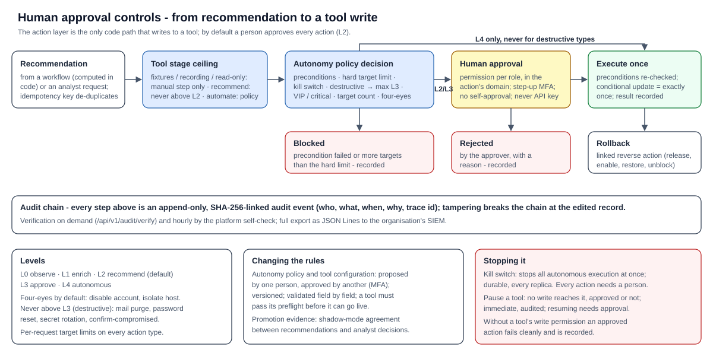

# Security risk and governance

| | |
|---|---|
| **Document** | Security risk and governance - Agentic SOC platform |
| **Version** | 1.0 - 2026-10-10 |
| **Audience** | Security risk, governance and compliance, SOC management, internal audit |

## About the platform

The Agentic SOC platform is an investigation and automation layer that runs inside the organisation's own environment,
on top of the security tools it already owns (EDR, e-mail security, identity, DNS, deception, privileged access,
vulnerability scanners, cloud posture, ITSM / CMDB, SIEM). It reads from those tools through their APIs, resolves every
record to one host or one person, and runs three workflows - reported phishing, incident management and
vulnerability management - plus a cross-domain intelligence layer. Every change it makes to a security tool is an
*action request* that passes through one governed action layer and a versioned *autonomy policy*, whose default is
**recommend**: a person approves each action. An optional large language model, reached only through the
organisation's own LLM gateway, writes explanatory narrative but never produces a figure, verdict, score or decision.

**Status terms used in this document:** *Implemented* - built, enforced in code and covered by automated tests that
run on every build; *Configured at deployment* - built, with the value chosen by or taken from the organisation's
environment; *To validate in the organisation's environment* - built and tested against vendor-shaped data, not yet
exercised against the organisation's own tenants, volumes or users (covered by the pilot).

## 1 Summary

- The platform holds read access - and, once approved, write access - across the security estate, so it is treated as
  **production security infrastructure**: least privilege, step-up MFA, separation of duties, a tamper-evident audit
  chain and a durable kill switch.
- **Humans decide.** Every write to a security tool is an action request; the default for every action type is
  *recommend* (L2), so a person approves each one. Irreversible actions can never run autonomously. Approval
  permissions can never be held by a service account.
- **Everything is accountable.** Every change, decision, approval, configuration change and model call is an
  append-only, hash-chained audit event; one trace id links each request or job to everything it caused.
- **Tested adversarially.** A penetration suite attacks the platform on every build; a white-box review and live
  probing found and fixed 14 issues (3 high); input fuzzing covers every API field, every connector field and every
  policy document.

## 2 Risk assessment

Ratings are the inherent risk before controls and the residual risk with the controls in place, proposed for joint
review with the organisation (H = high, M = medium, L = low). References R01-R16 are the project's risk register.

| # | Risk | Inherent | Controls in place | Residual | Owner |
|---|---|---|---|---|---|
| 1 | **The platform is compromised** and used as a pivot into the security tools it can reach (R07) | H | Client-hosted, private network, inbound only via the TLS proxy; Entra SSO with MFA; per-tool least-privilege identities with read scopes by default; write scopes per approved action; every write gated by the autonomy policy and human approval; secrets only in the vault; non-root containers; penetration suite on every build | M | Joint |
| 2 | **Stolen analyst session or token** used for high-impact decisions | H | RS256 tokens validated against the tenant keys (audience, issuer, expiry required); step-up MFA for approvals, rollback, policy, kill switch and access management; per-token and per-user revocation; dev sign-in refused in production | L | Joint |
| 3 | **Insider misuse or over-privilege** | M | Five roles with least privilege; domain scoping per role (out-of-scope records answer "not found"); no self-approval of four-eyes actions, policies, exceptions or access grants; time-bound, justified grants; full audit and access logs | L | Organisation |
| 4 | **Over-automation disrupts the business** (R04) | H | Default L2 for every action type; tool stage ceiling (*Recommend* never above L2); four-eyes for account disablement and host isolation; destructive types capped at L3; VIP / critical-asset and target-count gates; hard limit blocks; durable kill switch; reversible actions roll back | L | Organisation |
| 5 | **Wrong entity resolution** routes a decision or a notification to the wrong host or person (R01) | M | Vendor ids as conflict keys (never merged); hardware identifiers need name corroboration; unsure matches go to an analyst queue; stress tests: 0 false merges for 400 hosts and 300 people | L | Joint (validate in pilot) |
| 6 | **AI produces unsupported claims or is manipulated by injected content** (R02) | H | The AI never produces figures, verdicts or actions; grounding and numeric-fidelity guardrails; untrusted-output checks; read-only analyst tools; prompt-injection test | L | Joint |
| 7 | **Sensitive data exposure** - e-mail content, identity and privileged-access data (R10) | H | Data stays in the organisation's environment; files encrypted at rest; retention with automatic legal hold; domain-scoped access; pseudonymisation before any AI call; internal indicators never sent to threat-intel services | M | Organisation |
| 8 | **An integration credential is compromised** | H | One identity per tool, least privilege, read scopes by default; certificate credentials supported for Microsoft apps; secrets only in the vault, never in configuration, database, console or logs; rotation by replacing the vault file | M | Organisation |
| 9 | **Tampering with history or evidence** | M | Append-only audit table (the platform refuses update and delete), SHA-256 chain, verification on demand and hourly; database role INSERT / SELECT only on the audit table | L | Joint |
| 10 | **Tampering with configuration** (redirecting a connector, switching a tool off or promoting it to act) | M | Four-eyes proposals (proposer cannot approve; MFA); strict schema; preflight before going live; versioned with restore; pausing - the safe direction - is the only immediate change | L | Organisation |
| 11 | **Supply chain** - dependencies, ML model files | M | `pip-audit` clean; unused packages removed; ML model files verified by SHA-256 manifest before loading; no runtime npm dependencies in the console; pinned scikit-learn version | L | Joint |
| 12 | **The platform degrades the source tools** - rate-limit exhaustion (R06) | M | Per-tool request budgets split across processes; `Retry-After` honoured; inventories and event streams read incrementally | L | Joint (measure in pilot) |
| 13 | **Availability** - a tool, the LLM or the database fails | M | Tool outages shown as "unavailable", never a silent verdict change; LLM circuit breaker with deterministic fallback; database saturation answers 503 with retry; scheduler self-healing, dead letters raise findings; stateless API replicas | L | Joint |
| 14 | **Malicious attachment execution** (R12) | M | The sandbox agent is disabled unless an isolated detonation host is configured; detonation hardening fails closed (no network, read-only root, capabilities dropped, seccomp, limits); the Docker socket is not mounted in platform services | L | Organisation (if detonation used) |
| 15 | **Disclosure through notifications** - finding titles can name users and hosts | M | Destinations only from configuration, HTTPS only, threshold-based; webhook URLs never stored, logged or shown | M | Organisation (choose channels) |
| 16 | **Detection and model drift** over time (R14) | M | Drift monitoring (agreement with analysts, distribution shift, confidence) raises findings; shadow-mode agreement metrics; deterministic rules unaffected by model drift | L | Joint |
| 17 | **Live behaviour differs from tested behaviour** - tenant data shapes, volumes, permissions (R08) | M | Conformance and fuzz suites; preflight per tool; Recording stage to capture real shapes; staged rollout one tool at a time; pilot exit criteria | L after pilot | Joint |

## 3 Role-based access control

**Roles and permissions** (enforced in code, `core/auth.py`):

| Permission | Analyst | Lead | Automation admin | Admin | Auditor |
|---|---|---|---|---|---|
| Read cases, findings, dashboards | ✓ | ✓ | ✓ | ✓ | ✓ |
| Read the audit log | ✓ | ✓ | ✓ | ✓ | ✓ |
| Investigate (enrich, dispositions, notes, deep analysis) | ✓ | ✓ | | | |
| Request actions | ✓ | ✓ | | | |
| Approve actions (not high-impact) | ✓ | ✓ | | | |
| Approve high-impact actions (four-eyes, VIP, large blast radius) | | ✓ | | | |
| Roll back actions | | ✓ | | | |
| Resolve entities (review queue, overrides) | ✓ | ✓ | | | |
| Propose autonomy policy | | | ✓ | | |
| Approve autonomy policy and connector changes | | ✓ | | | |
| Manage connectors (propose configuration, pause, test notifications) | | | ✓ | ✓ | |
| Kill switch | | ✓ | ✓ | ✓ | |
| Manage access (grants, API keys, session revocation, AI usage policy) | | | | ✓ | |
| Export compliance evidence | | ✓ | | ✓ | ✓ |

| Control | Behaviour | Status |
|---|---|---|
| Source of roles | Entra ID app roles `SOC.<Role>` or `SOC.<Role>.<Domain>` assigned to groups; platform grants (time-bound, justified, audited) on top. Unknown role claims grant nothing | Implemented; configured at deployment |
| Domain scope | Any role can be limited to phishing, incident and / or vulnerability. Every list is filtered; every record route checks the record's domain and answers "not found" out of scope - including reports, the audit log and the access log. Cross-domain views (intelligence, brief, metrics) need all-domain scope | Implemented |
| Per-role scope | A user sees the union of their roles' domains, but each permission counts only where the role granting it applies (a phishing lead who is also an all-domain auditor approves phishing actions only) | Implemented |
| Step-up MFA | Approvals, rollback, policy approval, kill switch and access management need a token showing MFA (`amr`) or the configured Conditional Access authentication context; on by default in production | Implemented |
| Human-only permissions | Approvals, policy, access management and rollback are never granted to API-key principals, whatever roles a key holds | Implemented |
| Separation of duties | No one approves their own action, policy, exception, connector change or access grant; automation admins configure but cannot approve; a scoped administrator grants only their own domains | Implemented |
| Service accounts | API keys: only the SHA-256 is stored; expiry at most 365 days; roles limited to analyst, auditor or automation admin; shown once | Implemented |
| Revocation | Per token (logout) and per user (revoke all sessions) | Implemented |
| Break-glass | For identity-provider outages: a sealed secret of which only the hash is configured; every use and failed attempt is audited and raises a critical finding | Implemented; configured at deployment |

## 4 Audit logging

| Record | Content | Integrity | Retention |
|---|---|---|---|
| **Audit chain** | Every change and decision: action requests, approvals, rejections, executions, rollbacks; policy and configuration proposals, approvals and restores; access grants and revocations; case work (assignment, notes by length, dispositions); agent recommendations; model use; report builds and exports; retention runs; break-glass use. **Every successful write request leaves at least one event** (a generic one where a route's own code wrote none). Each event: actor, time, type, subject, payload, trace id | Append-only (update and delete refused); each record's SHA-256 covers the previous record's hash; concurrent writers serialised; `GET /api/v1/audit/verify` reports the first altered record; verified hourly by the self-check | Never pruned by the platform; export as JSON Lines with chain verification for archiving |
| **Access log** | Every API request: who, authentication method, method, path, status, client address, user agent, latency | Append-only | 400 days (configurable) |
| **Model-call log** | Every model call or refusal | - | Text 180 days; figures kept |
| **Job runs** | Every scheduled or replayed job: outcome, attempts, error, summary | - | - |
| **Application log** | Structured line per request, audit event, model call, outbound call, job and command; secrets masked | Shipped to the organisation's log platform | The organisation's policy |

**Trace ids.** Every request (`X-Request-ID`, reused from the proxy when it is a safe value), job and command gets a
trace id that is stored on the access-log row, every audit event, every model call and the job run, and printed on
every log line. The *Trace* view shows everything one request or job did, in order - including each model call's
prompt, answer and the statements the guardrail removed.

**Read access** to the audit log is scoped: domain-scoped readers see records about their domains and their own
actions; the full export needs all-domain scope.

## 5 Monitoring

| Signal | Source | Suggested alert |
|---|---|---|
| Liveness and integrity | `/health` (database, audit-chain validity, kill switch, scheduler state) | Audit chain not valid; scheduler `stale` / `stuck` / `never` |
| Operational metrics | `/metrics` (Prometheus; auditor API key, all-domain scope): open cases, actions by status, insights, unresolved entities, seconds since each stream's last successful sync, kill switch | Sync age above the stream's cadence; kill switch engaged |
| Integrations | Integrations screen: per-connector state (healthy / stale / error / misconfigured), freshness per stream, reconciliation against the tool's own totals | Connector in error or stale |
| Jobs | Job history; a job failing 3 runs in a row is dead-lettered and raises a finding | Any dead-lettered job |
| Platform self-check (hourly) | Recomputes each shared figure through every code path, resolves every stored reference, looks for duplicates, verifies the audit chain; alerts only when a check fails twice | Self-check finding |
| AI usage | AI usage screen; findings at 80 % and 100 % of the monthly budget and while a day's budget is used up | Budget findings; model-call errors |
| Logs | stdout (JSON): `level` WARNING / ERROR, `job.end` not ok, `llm.call` error, `connector.http` errors, `connector.data_quality` (vendor sent an unexpected shape), `ingest.rejected` (pushed alerts refused) | As listed |
| Security events | Break-glass use, revoked sessions, configuration and policy changes, kill switch - all audit events, and break-glass use raises a critical finding | Forward the audit export to the SIEM |

Operational findings (dead-lettered jobs, break-glass use, failing self-check, AI budget) can also be pushed to Teams,
Slack or a webhook.

## 6 Human approval controls

**Autonomy levels:** L0 observe, L1 enrich, L2 recommend (default), L3 approve, L4 autonomous. The policy decides each
request's effective level, in this order: a failed precondition blocks; more targets than the hard limit blocks; the
kill switch caps at L3; a destructive action type caps at L3; a VIP or critical-asset target forces L3 and
high-impact; more targets than the action's limit forces L3 and high-impact; four-eyes marks it high-impact. All
reasons are shown to the approver.

**Default policy** (every action type is L2 - recommend - until the organisation approves a change):

| Action type | Tool | Per-request target limit | Four-eyes | Never autonomous (destructive) | Reversible by |
|---|---|---|---|---|---|
| `identity.disable_account` | Entra ID | 3 | ✓ | | `identity.enable_account` |
| `identity.revoke_sessions` | Entra ID | 10 | | | - |
| `identity.reset_password` | Entra ID | 10 | | ✓ | - |
| `identity.confirm_compromised` | Entra ID | 25 | | ✓ | - |
| `endpoint.isolate` | Defender for Endpoint, CrowdStrike | 5 | ✓ | | `endpoint.release` |
| `endpoint.collect_forensics` | Defender for Endpoint, CrowdStrike | 25 | | | - |
| `endpoint.scan` | Defender for Endpoint | 25 | | | - |
| `indicator.block` | Defender for Endpoint | 25 | | | `indicator.unblock` |
| `email.campaign_purge` | Defender for Office 365 | 200 | | ✓ | `email.restore` |
| `email.block_sender` | Defender for Office 365 | 25 | | | `email.unblock_sender` |
| `email.tag`, `email.reporter_feedback` | Defender for Office 365 | 25 | | | - |
| `email.gateway_quarantine` | Avanan | 25 | | | `email.gateway_restore` |
| `dns.block_domain` | Umbrella | 25 | | | `dns.unblock_domain` |
| `pam.rotate_secret` | Delinea Secret Server | 5 | | ✓ | - |
| `canary.acknowledge` | Canary | 25 | | | - |
| `ticket.create`, `ticket.update`, `notify.email` | ServiceNow / Jira, Defender for Office 365 | 25 | | | - |

All action types also have a hard limit of 5,000 targets per request, above which the request is blocked.

| Control | Behaviour | Status |
|---|---|---|
| Single execution path | The action layer is the only code that calls a tool's write method | Implemented |
| Idempotency | Each request has a key (type, parameters, targets, case); a repeat returns the existing request | Implemented |
| Exactly-once execution | Approval is a conditional status update: six simultaneous approvals execute once (tested) | Implemented |
| Preconditions | Re-checked at execution; a stale target is blocked and recorded | Implemented |
| Rollback | Reversible actions create a linked reverse action; needs the rollback permission (lead) | Implemented |
| Policy change control | Proposed by an automation admin, approved by a different person with `approve_policy` and MFA; validated field by field; versioned | Implemented |
| Kill switch | One action in the console (lead / admin / automation admin, MFA); stored in the database, honoured by every replica and the scheduler, survives restarts | Implemented |
| Pause a tool | Immediate, audited, reason required; its actions become manual steps; resuming is a proposal | Implemented |
| Promotion evidence | Shadow-mode metrics: agreement between what the platform recommended and what analysts decided, per domain | Implemented |

## 7 Security testing performed

| Activity | Scope | Outcome |
|---|---|---|
| Automated penetration suite (every build) | Unauthenticated and forged credentials on every route (`alg: none`, wrong keys, expired, algorithm confusion, Basic, SQL in keys); role and scope escalation; injection payloads in every parameter; prompt injection in a reported e-mail; path traversal; oversized and malformed uploads; stored XSS on 8 screens; CORS, TRACE; key guessing; concurrent approvals; spoofed `X-Forwarded-For`; production-mode exposure | Every attack refused (401 / 403 / 404 / 413 / 422 / 429 as appropriate); no 5xx; nothing executed |
| White-box review and live probing (round 2) | Every route, the authentication and access layers, the console's HTML sinks; ReDoS timing of every regular expression on hostile inputs up to 2.4 MB | 14 findings (3 high, 6 medium, 4 low, 1 info), all fixed with regression tests |
| Input fuzzing | Every request field and query parameter of every API route; every field of every connector stream with wrong types; every node of the autonomy policy, AI usage policy and connector configuration; corrupted e-mails; model answers of every shape | All handled without a server error; malformed items refused with a reason |
| Static analysis | bandit over the platform and scripts | No medium or high findings |
| Dependency audit | pip-audit (Python), npm audit (test tooling) | No known vulnerabilities |
| Browser tour | Real browser over every screen at 4 widths, accessibility scan, stored-XSS probe, screen-versus-API figure cross-check | No problems |
| Database parity | The full suite on SQLite and PostgreSQL 16, with PostgreSQL's constraints enforced in SQLite runs | Identical results |

## 8 The organisation's responsibilities

These controls depend on the hosting environment and cannot be enforced by the platform's code:

- Run behind TLS; restrict network access to the API; list the reverse proxy in `SOC_TRUSTED_PROXIES`.
- Production settings: `SOC_ENVIRONMENT=prod`, `SOC_AUTH_MODE=entra`, `SOC_DATA_KEY` from the vault, break-glass hash
  configured and the secret sealed with two custodians.
- Entra app roles assigned to groups; Conditional Access requiring MFA; "assignment required" on the application.
- Per-tool service identities with read scopes first; write scopes only per approved action type.
- Database: TLS, backups with a tested restore, INSERT / SELECT only on the audit table for the platform's login.
- Give *propose* (automation admin / admin) and *approve* (lead) to different people; review the configuration
  history together with the audit log.
- Forward logs and the audit export to the organisation's SIEM and alert on the signals in section 5.
- Choose notification channels appropriate for finding titles that may name users and hosts.
- Operate any detonation host on an isolated network segment with no route to production.
